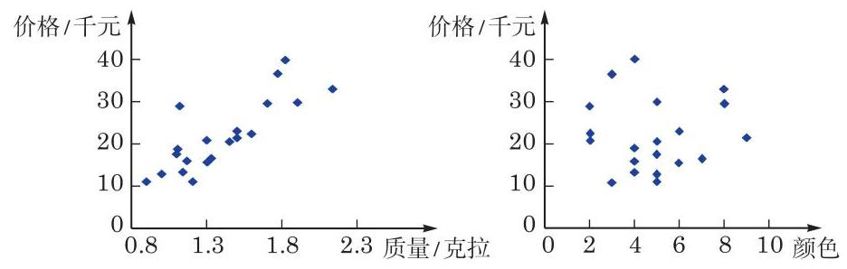

# 例题卡：例 2 某宝石店经理随机选取了 20 颗钻石, 将它们的价格 (单位:千元)、质量(单位:克拉)以及颜色记录在表 13-4 中. 试分别绘制质量与价格的散点图, 以及颜色与价格的散点图, 并观察随着钻石的质量和颜色数值的增加, 钻石的价格是如何变化的.

例 2 某宝石店经理随机选取了 20 颗钻石, 将它们的价格 (单位:千元)、质量(单位:克拉)以及颜色记录在表 13-4 中. 试分别绘制质量与价格的散点图, 以及颜色与价格的散点图, 并观察随着钻石的质量和颜色数值的增加, 钻石的价格是如何变化的.

表 13-4 某宝石店的 20 颗钻石的价格、质量及颜色

<table id="cross-table-1"><tr><td>序号</td><td>价格/千元</td><td>质量/克拉</td><td>颜色</td></tr><tr><td>1</td><td>11</td><td>0.9</td><td>3</td></tr><tr><td>2</td><td>11</td><td>1.21</td><td>5</td></tr><tr></tr><tr><td>3</td><td>12.9</td><td>1</td><td>5</td></tr><tr><td>4</td><td>13.2</td><td>1.14</td><td>4</td></tr><tr><td>5</td><td>15.5</td><td>1.3</td><td>6</td></tr><tr><td>6</td><td>15.9</td><td>1.17</td><td>4</td></tr><tr><td>7</td><td>16.6</td><td>1.33</td><td>7</td></tr><tr><td>8</td><td>17.6</td><td>1.1</td><td>5</td></tr><tr><td>9</td><td>18.9</td><td>1.11</td><td>4</td></tr><tr><td>10</td><td>20.6</td><td>1.45</td><td>5</td></tr><tr><td>11</td><td>20.8</td><td>1.3</td><td>2</td></tr><tr><td>12</td><td>21.6</td><td>1.5</td><td>9</td></tr><tr><td>13</td><td>22.5</td><td>1.6</td><td>2</td></tr><tr><td>14</td><td>22.8</td><td>1.5</td><td>6</td></tr><tr><td>15</td><td>28.8</td><td>1.12</td><td>2</td></tr><tr><td>16</td><td>29.5</td><td>1.7</td><td>8</td></tr><tr><td>17</td><td>29.8</td><td>1.9</td><td>5</td></tr><tr><td>18</td><td>33</td><td>2.13</td><td>8</td></tr><tr><td>19</td><td>36.6</td><td>1.77</td><td>3</td></tr><tr><td>20</td><td>40</td><td>1.82</td><td>4</td></tr></table>

注:颜色通过标准尺度来衡量，其中 1 为无色，随着数值的增加，颜色逐渐加深.

解 我们将价格作为纵坐标, 质量和颜色分别作为横坐标, 分别绘制散点图, 如图 13-4-7 所示.

图 13-4-7 某宝石店的 20 颗钻石的价格分别与质量、颜色散点图

从图 13-4-7 中我们可以看出, 随着钻石质量的增加, 钻石的价格呈现逐渐上升的趋势, 但价格的增减随着颜色的变化却看不出明显的规律, 这说明价格和颜色之间可能不存在明显的关系.

我们在这一节讨论了频率分布直方图、茎叶图以及散点图. 在初中阶段我们还学习了条形图、扇形图以及折线图等. 在对数据进行分析和整理时, 应根据需要选择恰当的统计图. 散点图一般用于刻画成对的数据, 并且可以从图中看出成对数据之间是否存在某种关系. 茎叶图呈现了数据的所有信息, 但不适合数据量较大的情形. 当数据量较大时一般选用条形图或频率分布直方图, 它们能直观地反映数据分布的大致情况. 而如果想呈现每部分所占的比例, 则需要用到扇形图. 折线图则主要用于呈现数据随着时间变化的趋势.
