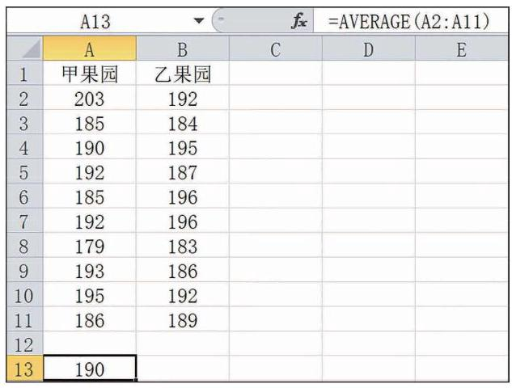

# 公式卡：信息技术:计算样本数据的数字特征

当样本量很大时, 纸笔计算样本的数字特征非常麻烦, 而计算机或计算器可以帮助我们方便地得到数据的数字特征. 下面, 作为一个示例, 我们介绍利用电子表格办公软件计算平均数的操作步骤:

(1)在空白表格中输入要处理的数据，单击某空白单元格.

(2)单击公式菜单中的“插入函数”，选择统计类别中的 "AVERAGE"; 单元格中则会出现“=AVERAGE( )”; 也可以直接在单元格中输入 “=AVERAGE( )”.

---

标准差是样本数据到平均数的一种平均距离. 由统计理论可知, $\left\lbrack  {\bar{x} - {2s},\bar{x} + {2s}}\right\rbrack$ 包含大多数样本数据.

---

(3)将光标放在括号内，然后选择这组数据，点击回车，平均数就计算出来了, 如图 13-5-4 所示.

类似地, 我们可以用电子表格办公软件或计算器计算一组数据的方差、标准差等其他数字特征.
