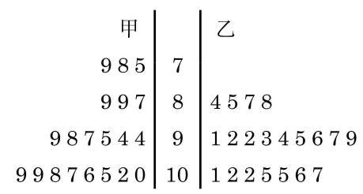

# 公式卡：2.2 通过样本估计总体的离散程度

现在我们介绍如何用数量来描述数据的另外一种统计特征一一样本数据的离散程度.

在一次男子10 米气手枪射击比赛中, 甲运动员的成绩(单位: 环)为7.5、7.8、...、10.9；乙运动员的成绩为 8.4、8.5、...、 10.7 , 如图 13-5-3 所示.

---

原始记录没有提供每个数据的准确值, 只提供了它们所在的区间. 这时, 为了计算均值, 可用区间的中点值给区间内的每个数据赋值.

---

图 13-5-3 甲、乙两位运动员 20 次气手枪比赛成绩的茎叶图

射击队想从两位选手中选取一名外出参加比赛，经过计算可知, 两位选手 20 次射击的平均环数都是 9.6 , 但从图 13-5-3 中看, 甲的成绩比较分散, 乙的成绩则相对稳定在高环数段. 但看上去“比较分散”和“相对稳定”只是一种直观的描述，我们需要用一些具有统计意义的数量来刻画数据的波动情况.

设样本数据为 ${x}_{1}\text{ 、 }{x}_{2}\text{ 、 }\cdots \text{ 、 }{x}_{n}$ ,我们知道 $\bar{x}$ 表示的是样本平均数. 在 13.4 节中我们已学习过极差, 它反映了样本数据变化的最大幅度, 是样本数据离散程度的一种刻画方式. 极差对极端数据很敏感, 也就是说它是不稳定的.

此外, 在初中阶段我们已学习过用样本数据的方差

$$
{s}^{2} = \frac{{\left( {x}_{1} - \bar{x}\right) }^{2} + {\left( {x}_{2} - \bar{x}\right) }^{2} + \cdots  + {\left( {x}_{n} - \bar{x}\right) }^{2}}{n}
$$

$$
= \frac{1}{n}\mathop{\sum }\limits_{{i = 1}}^{n}{\left( {x}_{i} - \bar{x}\right) }^{2}
$$

来衡量一组数据的波动大小. 一组数据的方差越大, 表明这组数据波动越大.

我们把方差的算术平方根

$$
s = \sqrt{\frac{{\left( {x}_{1} - \bar{x}\right) }^{2} + {\left( {x}_{2} - \bar{x}\right) }^{2} + \cdots  + {\left( {x}_{n} - \bar{x}\right) }^{2}}{n}}
$$

$$
= \sqrt{\frac{1}{n}\mathop{\sum }\limits_{{i = 1}}^{n}{\left( {x}_{i} - \bar{x}\right) }^{2}}
$$

叫做样本数据的标准差 (standard deviation), 它同样是一个用来衡量样本数据波动大小的统计量.

方差和标准差都反映了一组数据围绕平均数波动的大小, 方差的单位是观测数据的单位的平方, 而标准差的单位与观测数据的单位一致, 因此我们常常用标准差来描述数据的离散程度.

---

在实验中, 为了消除系统性偏差, 标准差公式中往往以 $n - 1$ 代替 $n$ ,用

$\int \underset{n}{\underbrace{{\left( {x}_{1} - \bar{x}\right) }^{2} + {\left( {x}_{2} - \bar{x}\right) }^{2} + \cdots  + {\left( {x}_{n} - \bar{x}\right) }^{2}}}$

来作为总体标准差的估计值.

---

我们可以得出上述例子中甲、乙两名运动员的射击成绩的标准差:

$$
{s}_{\text{ 甲 }} \approx  {1.05},{s}_{\text{ 乙 }} \approx  {0.71}\text{ . }
$$

由于 ${s}_{11} > {s}_{Z}$ ,说明甲的成绩确实较乙的成绩更为离散,即乙的成绩较为稳定, 与从茎叶图上观察到的结论一致, 射击队应选拔乙参加比赛.
