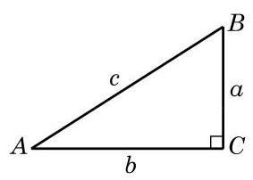

# 定理卡：1 锐角的正弦、余弦、正切、余切

$$
\sin A = \frac{a}{c},\cos A = \frac{b}{c},\tan A = \frac{a}{b},\cot A = \frac{b}{a}.
$$

如图 6-1-1,将直角三角形 ${ABC}$ 中(其中 $\angle C = {90}^{ \circ  }$ ) $\angle A$ 、 $\angle B\text{ 、 }\angle C$ 的对边边长分别记作 $a\text{ 、 }b\text{ 、 }c$ . 在初中我们已经知道, 锐角 $A$ 的正弦、余弦、正切、余切的定义分别为

由简单的比值关系以及勾股定理, 还有如下结论:

$$
{\sin }^{2}A + {\cos }^{2}A = 1,\tan A = \frac{\sin A}{\cos A},
$$

$$
\cot A = \frac{\cos A}{\sin A},\cot A = \frac{1}{\tan A},
$$

$$
\sin \left( {{90}^{ \circ  } - A}\right)  = \cos A,\cos \left( {{90}^{ \circ  } - A}\right)  = \sin A,
$$

$$
\tan \left( {{90}^{ \circ  } - A}\right)  = \cot A,\cot \left( {{90}^{ \circ  } - A}\right)  = \tan A.
$$

我们还知道如下一些特殊角的正弦、余弦、正切、余切值 (表 6-1):

表 6-1
