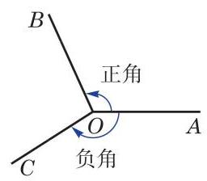
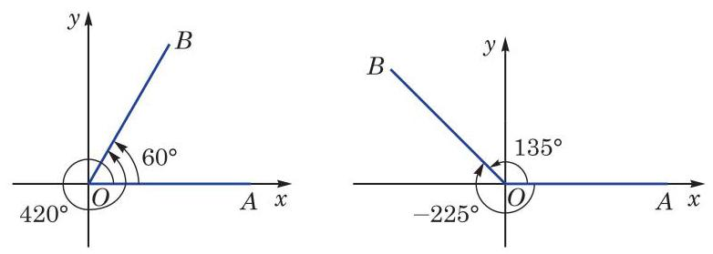

# 概念卡：2 任意角及其度量

在小学和初中我们已经知道, 角是具有公共端点的两条射线所组成的图形, 角还可以看作是平面上由一条射线绕着其端点从初始位置(始边)旋转到终止位置(终边)所形成的图形(图 6-1-2). 我们以前学习过的锐角、直角、钝角、平角和周角, 其大小都在 ${0}^{ \circ  }$ 到 ${360}^{ \circ  }$ 之间. 不过在体操、跳水等体育运动中,会听到转体 720°、转体1 080°等术语；当手表比标准时间慢或者快 10 分钟的时候,只需要将分针旋转 ${60}^{ \circ  }$ 就可以调节准确,但也有按顺时针和逆时针方向旋转的差异. 因此,要准确地刻画这些现象,对于角而言, 不但要考察旋转量, 而且要考察旋转方向, 这就需要适当推广角的概念.

习惯上规定:一条射线绕端点按逆时针方向旋转所形成的角为正角，其度量值是正的；按顺时针方向旋转所形成的角为负角, 其度量值是负的(图 6-1-2).

特别地, 当一条射线没有旋转时, 我们也认为形成了一个角, 称为零角. 零角的始边与终边重合.

这样, 我们可将角的概念推广到任意角, 包括正角、负角与零角,也包括超过 ${360}^{ \circ  }$ 的角.

为了便于研究角及与其相关的问题, 可将角置于平面直角坐标系中,使得角的顶点与坐标原点重合,角的始边与 $x$ 轴的正半轴重合. 此时角的终边在第几象限, 就说这个角是第几象限的角,或者说这个角属于第几象限. 如图 6-1-3, ${60}^{ \circ  }$ 和 ${420}^{ \circ  }$ 都是第一象限的角, ${135}^{ \circ  }$ 和 $- {225}^{ \circ  }$ 都是第二象限的角. 当角的终边在坐标轴上时, 就不说这些角属于哪一象限.

例如,若角 $\alpha$ 是第一象限的角,将其终边绕原点逆时针旋转 ${90}^{ \circ  }$ 后,所得的角 $\alpha  + {90}^{ \circ  }$ 是第二象限的角; 将其终边绕原点逆时针旋转 ${180}^{ \circ  }$ 后,所得的角 $\alpha  + {180}^{ \circ  }$ 是第三象限的角; 而将其终边绕原点顺时针旋转 ${90}^{ \circ  }$ 后,所得的角 $\alpha  - {90}^{ \circ  }$ 则是第四象限的角.

从角的形成过程中可以看到,与某一个角 $\alpha$ 的始边相同且终边重合的角有无数个,它们的大小与角 $\alpha$ 都相差 ${360}^{ \circ  }$ 的整数倍. 在图 6-1-3 中, ${60}^{ \circ  }$ 的角和 ${420}^{ \circ  }$ 的角的终边重合,前者与后者之差为 $- {360}^{ \circ  };{135}^{ \circ  }$ 的角和 $- {225}^{ \circ  }$ 的角的终边重合,前者与后者之差为 ${360}^{ \circ  }$ . 进一步,我们可以把所有与角 $\alpha$ 的终边重合的角 (包括角 $\alpha$ 本身)的集合表示为

$$
\{ \beta  \mid  \beta  = k \cdot  {360}^{ \circ  } + \alpha , k \in  \mathbf{Z}\} .
$$

---

为简单起见, 在不引起混淆的前提下， “角 $\alpha$ ”或“ $\angle \alpha$ ”可简记作“ $\alpha$ ”.

---
