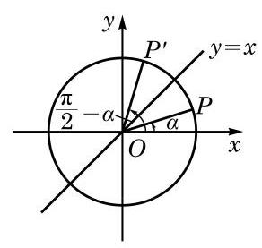

# 练习卡：练习 6.1(6)

1. 证明:

(1) $\sin \left( {{2\pi } - \alpha }\right)  =  - \sin \alpha$ ; (2) $\cos \left( {{2\pi } - \alpha }\right)  = \cos \alpha$ ;

(3) $\tan \left( {{2\pi } - \alpha }\right)  =  - \tan \alpha$ ； (4) $\cot \left( {{2\pi } - \alpha }\right)  =  - \cot \alpha$ .

2. 利用诱导公式求值:

(1) $\sin \frac{11}{4}\pi$ (2) $\cos \left( {-\frac{5}{6}\pi }\right)$ ； (3) $\tan \left( {-\frac{14}{3}\pi }\right)$ .

3. 化简:

(1) $\frac{\sin \left( {{180}^{ \circ  } - \alpha }\right) }{\sin \left( {{180}^{ \circ  } + \alpha }\right) } + \frac{\cos \left( {{360}^{ \circ  } - \alpha }\right) }{\cos \left( {{180}^{ \circ  } + \alpha }\right) } + \frac{\tan \left( {{180}^{ \circ  } + \alpha }\right) }{\tan \left( {-\alpha }\right) }$ ;

(2) $\frac{\sin \left( {\pi  - \alpha }\right) }{\cos \left( {\pi  + \alpha }\right) } \cdot  \frac{\sin \left( {{2\pi } - \alpha }\right) }{\tan \left( {\pi  + \alpha }\right) }$ .

角 $\alpha$ 的终边与角 $\frac{\pi }{2} - \alpha$ 的终边关于直线 $y = x$ 对称 (图 6-1-14),角 $\alpha$ 的终边与单位圆交于点 $P\left( {\cos \alpha ,\sin \alpha }\right)$ ,而角 $\frac{\pi }{2} - \alpha$ 的终边与单位圆交于点 ${P}^{\prime }\left( {\cos \left( {\frac{\pi }{2} - \alpha }\right) ,\sin \left( {\frac{\pi }{2} - \alpha }\right) }\right)$ . 由于点 $P$ 与点 ${P}^{\prime }$ 关于直线 $y = x$ 对称,即点 $P$ 的横坐标与点 ${P}^{\prime }$ 的纵坐标相等,而点 $P$ 的纵坐标与点 ${P}^{\prime }$ 的横坐标相等,因此有如下诱导公式:

$$
\sin \left( {\frac{\pi }{2} - \alpha }\right)  = \cos \alpha ,\;\cos \left( {\frac{\pi }{2} - \alpha }\right)  = \sin \alpha ,
$$

$$
\tan \left( {\frac{\pi }{2} - \alpha }\right)  = \cot \alpha ,\;\cot \left( {\frac{\pi }{2} - \alpha }\right)  = \tan \alpha .
$$

在以上公式中将 $\alpha$ 用 $- \alpha$ 代换，就有

$$
\sin \left( {\frac{\pi }{2} + \alpha }\right)  = \cos \left( {-\alpha }\right)  = \cos \alpha ,
$$

---

角 $\alpha$ 的终边和角 $- \alpha$ 的终边关于角 $\frac{\alpha  + \left( {-\alpha }\right) }{2} = 0$ 的终边所在直线 $\left( {x\text{ 轴 }}\right)$ 对称; 角 $\alpha$ 的终边和角 $\pi  - \alpha$ 的终边关于角 $\frac{\alpha  + \left( {\pi  - \alpha }\right) }{2} = \frac{\pi }{2}$ 的终边所在直线 $\left( {y\text{ 轴 }}\right)$ 对称. 一般地,角 $\alpha$ 的终边和角 $\beta$ 的终边关于角 $\frac{\alpha  + \beta }{2}$ 的终边所在直线对称.

---

即

$$
\sin \left( {\frac{\pi }{2} + \alpha }\right)  = \cos \alpha .
$$

同理, 有如下诱导公式:

$$
\sin \left( {\frac{\pi }{2} + \alpha }\right)  = \cos \alpha ,\;\cos \left( {\frac{\pi }{2} + \alpha }\right)  =  - \sin \alpha ,
$$

$$
\tan \left( {\frac{\pi }{2} + \alpha }\right)  =  - \cot \alpha ,\;\cot \left( {\frac{\pi }{2} + \alpha }\right)  =  - \tan \alpha .
$$

上述两组诱导公式说明正弦和余弦可以互相转化, 正切和余切也可以互相转化.

以上两组诱导公式说明角 $\frac{\pi }{2} \pm  \alpha$ 的正(余)弦、正(余)切值的绝对值,必等于角 $\alpha$ 的余(正)弦、余(正)切值的绝对值,但这两者可能差一个正负号. 这个正负号的确定方法是: 当 $\alpha$ 为锐角时, 等式两边必须同时为正数或同时为负数.

例如, $\cos \left( {\frac{\pi }{2} + \alpha }\right)$ 的绝对值应该同 $\sin \alpha$ 的绝对值相等,即成立 $\cos \left( {\frac{\pi }{2} + \alpha }\right)  =  \pm  \sin \alpha$ . 但当 $\alpha$ 为锐角时, $\frac{\pi }{2} + \alpha$ 是第二象限的角,这时 $\cos \left( {\frac{\pi }{2} + \alpha }\right)  < 0$ ,而 $\sin \alpha  > 0$ ,所以前式中应该取负号,即有 $\cos \left( {\frac{\pi }{2} + \alpha }\right)  =  - \sin \alpha$ .
