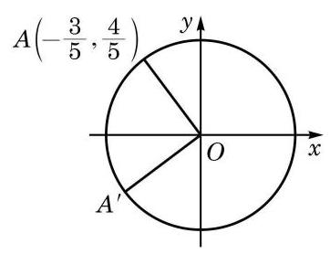

# 例题卡：例 19 已知点 $A$ 的坐标为 $\left( {-\frac{3}{5},\frac{4}{5}}\right)$ ,将 ${OA}$ 绕坐标原点 $O$ 逆时针旋转 $\frac{\pi }{2}$ 至 $O{A}^{\prime }$ . 求点 ${A}^{\prime }$ 的坐标.

例 19 已知点 $A$ 的坐标为 $\left( {-\frac{3}{5},\frac{4}{5}}\right)$ ,将 ${OA}$ 绕坐标原点 $O$ 逆时针旋转 $\frac{\pi }{2}$ 至 $O{A}^{\prime }$ . 求点 ${A}^{\prime }$ 的坐标.

$$
{x}^{\prime } = \cos \left( {\theta  + \frac{\pi }{2}}\right)  =  - \sin \theta  =  - \frac{4}{5},
$$

$$
{y}^{\prime } = \sin \left( {\theta  + \frac{\pi }{2}}\right)  = \cos \theta  =  - \frac{3}{5}.
$$

解 如图 6-1-15,由 ${OA} = O{A}^{\prime } = 1$ ,在单位圆中 $A(\cos \theta$ , $\sin \theta )$ 满足 $\cos \theta  =  - \frac{3}{5},\sin \theta  = \frac{4}{5}$ .

这样对点 ${A}^{\prime }\left( {{x}^{\prime },{y}^{\prime }}\right)$ ,有

所以，点 ${A}^{\prime }$ 的坐标为 $\left( {-\frac{4}{5}, - \frac{3}{5}}\right)$ .
