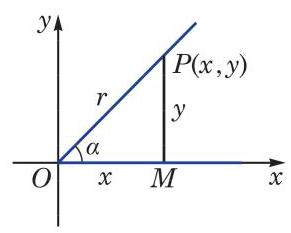
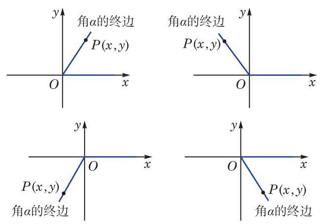

# 概念卡：3 任意角的正弦、余弦、正切、余切

我们将锐角 $\alpha$ 置于平面直角坐标系中,使角 $\alpha$ 的顶点与坐标原点 $O$ 重合,始边与 $x$ 轴的正半轴重合,那么它的终边必在第一象限. 如图 6-1-6,在角 $\alpha$ 的终边上任取异于原点的一点 $P\left( {x, y}\right)$ ,它与原点的距离 $r = \sqrt{{x}^{2} + {y}^{2}} > 0$ . 过点 $P$ 作 $x$ 轴的垂线,设垂足为 $M$ ,则线段 ${OM}$ 的长度 $\left| {OM}\right|$ 为 $x$ ,而线段 ${MP}$ 的长度 $\left| {MP}\right|$ 为 $y$ . 根据锐角的正弦、余弦、正切及余切的定义, 有

$$
\sin \alpha  = \frac{\left| MP\right| }{\left| OP\right| } = \frac{y}{r},\cos \alpha  = \frac{\left| OM\right| }{\left| OP\right| } = \frac{x}{r}.
$$

$$
\tan \alpha  = \frac{\left| MP\right| }{\left| OM\right| } = \frac{y}{x},\cot \alpha  = \frac{\left| OM\right| }{\left| MP\right| } = \frac{x}{y}.
$$

---

线段 ${OM}$ 的长度通常用 $\left| {OM}\right|$ 表示. 在不引起混淆的前提下， 也可用 OM 表示.

---

这说明锐角 $\alpha$ 的正弦、余弦、正切及余切可以用角 $\alpha$ 的终边上点的坐标来定义. 这样,就可以对任意给定的角 $\alpha$ ,定义其相应的正弦、余弦、正切及余切.

如图 6-1-7,在任意角 $\alpha$ 的终边上任取异于原点的一点 $P$ , 设其坐标为 $\left( {x, y}\right)$ ,并令 $\left| {OP}\right|  = r$ ,必有 $r = \sqrt{{x}^{2} + {y}^{2}} > 0$ . 这样,就可以分别定义角 $\alpha$ 的正弦、余弦、正切、余切为

$$
\sin \alpha  = \frac{y}{r},\;\cos \alpha  = \frac{x}{r},
$$

$$
\tan \alpha  = \frac{y}{x}\left( {x \neq  0}\right) ,\cot \alpha  = \frac{x}{y}\left( {y \neq  0}\right) .
$$

应当注意的是: 当 $\alpha  = {k\pi } + \frac{\pi }{2}\left( {k \in  \mathbf{Z}}\right)$ ,即角 $\alpha$ 的终边位于 $y$ 轴上时, $\tan \alpha  = \frac{y}{x}$ 无意义; 而当 $\alpha  = {k\pi }\left( {k \in  \mathbf{Z}}\right)$ ,即角 $\alpha$ 的终边位于 $x$ 轴上时, $\cot \alpha  = \frac{x}{y}$ 无意义.
