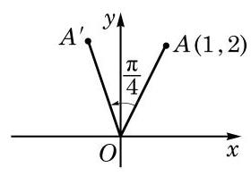

# 例题卡：例 8 若 $\bigtriangleup {ABC}$ 不是直角三角形,求证:

例 8 若 $\bigtriangleup {ABC}$ 不是直角三角形,求证:

$$
\tan A + \tan B + \tan C = \tan A\tan B\tan C.
$$

证明 因为 $A + B + C = \pi$ ,且 $\tan \left( {A + B}\right)  = \frac{\tan A + \tan B}{1 - \tan A\tan B}$ , 所以

$$
\tan A + \tan B = \tan \left( {A + B}\right) \left( {1 - \tan A\tan B}\right)
$$

$$
= \tan \left( {\pi  - C}\right) \left( {1 - \tan A\tan B}\right)
$$

$$
=  - \tan C\left( {1 - \tan A\tan B}\right) \text{ , }
$$

从而

$$
\tan A + \tan B + \tan C =  - \tan C\left( {1 - \tan A\tan B}\right)  + \tan C
$$

$$
= \tan A\tan B\tan C\text{ . }
$$

