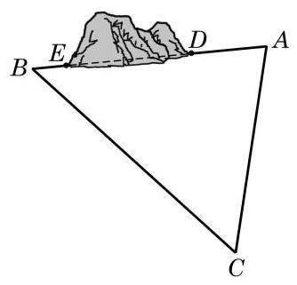

# 练习卡：练习 6.3(4)

1. 某货轮在 $A$ 处看灯塔 $S$ 在北偏东 ${30}^{ \circ  }$ 方向. 它以每小时 18 海里的速度向正北方向航行，经过 40 分钟航行到 $B$ 处，看灯塔 $S$ 在北偏东 ${75}^{ \circ  }$ 方向. 求此时货轮到灯塔 $S$ 的距离.

2. 我缉私船发现位于正北方向的走私船以每小时 30 海里的速度向北偏东 ${45}^{ \circ  }$ 方向的公海逃窜，已知缉私船的最大时速是 45 海里，为了及时截住走私船，缉私船应以什么方向追击走私船? (结果精确到 ${0.01}^{ \circ  }$ )

3. 修建铁路时要在一个山体上开挖一隧道, 需要测量隧道口 $D\text{ 、 }E$ 之间的距离. 测量人员在山的一侧选取点 $C$ ,因有障碍物, 无法直接测得 ${CE}$ 及 ${DE}$ 的距离. 现测得 ${CA} = {482.80}\mathrm{\;m},{CB} = \; {631.50}\mathrm{\;m},\angle {ACB} = {56.3}^{ \circ  }$ ; 又测得 $A$ 及 $B$ 两点到隧道口的距离分别是 ${80.13}\mathrm{\;m}$ 及 ${40.24}\mathrm{\;m}\left( {A\text{ 、 }D\text{ 、 }E\text{ 、 }B}\right.$ 在同一直线上 $)$ . 求隧道 ${DE}$ 的长. (结果精确到 $1\mathrm{\;m}$ )

(第 3 题)
