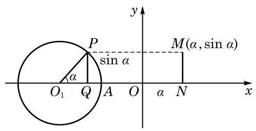
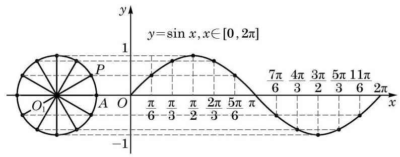
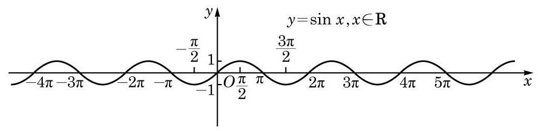
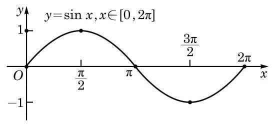

# 方法卡：1 正弦函数的图像

对任意给定的实数 $x$ ,都有 $\sin \left( {x + {2k\pi }}\right)  = \sin x, k \in  \mathbf{Z}$ . 这说明当 $x$ 的值增加或减少 ${2\pi }$ 的整数倍时, $\sin x$ 的值会重复出现. 因此,只要作出正弦函数 $y = \sin x$ 在区间 $\left\lbrack  {0,{2\pi }}\right\rbrack$ 上的图像, 就可以得到正弦函数在 $\mathbf{R}$ 上的图像.

下面，我们结合单位圆，利用描点法作 $y = \sin x$ 的大致图像.

为了描出 $y = \sin x$ 图像上的某个点 $M\left( {\alpha ,\sin \alpha }\right)$ ,先在平面直角坐标系的 $x$ 轴上任取一点 ${O}_{1}$ ,以点 ${O}_{1}$ 为圆心的单位圆与 $x$ 轴有两个交点,其中右边的一个交点记作 $A$ (图 7-1-1). 设 $P$ 是此单位圆上一点, $\angle A{O}_{1}P = \alpha$ ,作 ${PQ}$ 垂直于 $x$ 轴,其垂足为 Q. 对比以坐标原点 $O$ 为圆心的单位圆中角 $\alpha$ 的终边与单位圆的交点,可知点 $P$ 的纵坐标为 $\sin \alpha$ ,而 ${QP}$ 的长是 $\left| {\sin \alpha }\right|$ . 在 $x$ 轴上取点 $N\left( {\alpha ,0}\right)$ ,将线段 ${QP}$ 平移至 ${NM}$ 的位置使点 $Q$ 与点 $N$ 重合,从而点 $M$ 的坐标为 $\left( {\alpha ,\sin \alpha }\right)$ ,这样就得到了函数 $y = \sin x$ 图像上的一点 $M$ .

随着 $\alpha$ 的变化,可以得到函数 $y = \sin x$ 图像上的其他点.

方便起见,我们先将单位圆 ${O}_{1}$ 分为 12 等份 (等份数越多, 作出的图像越精确),使得角 $\alpha$ 的弧度数依次取 $0\text{ 、 }\frac{\pi }{6}\text{ 、 }\frac{\pi }{3}\text{ 、 }\frac{\pi }{2}$ 、 $\cdots \text{ 、 }{2\pi }$ ,再借助圆 ${O}_{1}$ 得到对应的纵坐标,依次作出函数 $y = \sin x$ 图像上的点 $\left( {0,\sin 0}\right) \text{ 、 }\left( {\frac{\pi }{6},\sin \frac{\pi }{6}}\right) \text{ 、 }\left( {\frac{\pi }{3},\sin \frac{\pi }{3}}\right)$ 、 $\left( {\frac{\pi }{2},\sin \frac{\pi }{2}}\right) \text{ 、 }\cdots \text{ 、 }\left( {{2\pi },\sin {2\pi }}\right)$ ,用光滑的曲线将这些点连接起来,就得到正弦函数 $y = \sin x, x \in  \left\lbrack  {0,{2\pi }}\right\rbrack$ 的大致图像 (图 7-1-2).

---

在本节的阅读材料中将说明简谐运动中物体离开平衡位置的位移关于时间的变化规律可以借助于正弦函数来描述.

单位圆是作正弦函数图像的有力工具. $\sin \alpha$ 就是角 $\alpha$ 的终边与以原点为圆心的单位圆交点的纵坐标.

---

因为 $\sin \left( {x + {2k\pi }}\right)  = \sin x, k \in  \mathbf{Z}$ ,所以函数 $y = \sin x$ 当 $x \in  \left\lbrack  {{2\pi },{4\pi }}\right\rbrack  , x \in  \left\lbrack  {{4\pi },{6\pi }}\right\rbrack  ,\cdots$ 时的图像与 $y = \sin x, x \in  \left\lbrack  {0,{2\pi }}\right\rbrack$ 的图像形状完全一样,只需将后者向右平移 ${2\pi }\text{ 、 }{4\pi }\text{ 、 }\cdots$ 就可得到. 同样,函数 $y = \sin x$ 当 $x \in  \left\lbrack  {-{2\pi },0}\right\rbrack  , x \in  \left\lbrack  {-{4\pi }, - {2\pi }}\right\rbrack  ,\cdots$ 时的图像与 $y = \sin x, x \in  \left\lbrack  {0,{2\pi }}\right\rbrack$ 的图像形状也完全一样,只需将后者向左平移 ${2\pi }\text{ 、 }{4\pi }\text{ 、 }\cdots$ 就可得到. 这样,就可以得到函数 $y = \sin x$ 的图像 (图 7-1-3). 正弦函数 $y = \sin x$ 的图像通常称为正弦曲线.

从图 7-1-2 可知， $\left( {0,0}\right) \text{ 、 }\left( {\frac{\pi }{2},1}\right) \text{ 、 }\left( {\pi ,0}\right) \text{ 、 }\left( {\frac{3\pi }{2}, - 1}\right)$ 和 $\left( {{2\pi },0}\right)$ 是函数 $y = \sin x, x \in  \left\lbrack  {0,{2\pi }}\right\rbrack$ 图像的五个关键点. 我们描出这五个点,并用光滑的曲线将它们连接起来,就得到函数 $y = \; \sin x, x \in  \left\lbrack  {0,{2\pi }}\right\rbrack$ 的大致图像 (图 7-1-4).

这种通过五个关键点作出正弦函数大致图像的方法, 通常称为“五点(作图)法”.
