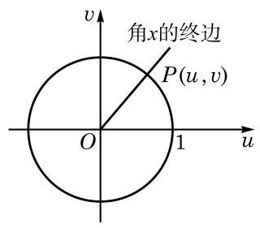

# 概念卡：(2) 值域与最值

设角 $x$ 的终边与以原点为圆心的单位圆交于点 $P$ (图7-1-6), 点 $P$ 的坐标为 $\left( {u, v}\right)$ . 由正弦的定义, $\sin x = v$ ,于是有 $\left| {\sin x}\right| \; = \left| v\right|  \leq  1$ .

因此，正弦函数 $y = \sin x, x \in  \mathbf{R}$ 的值域为 $\left\lbrack  {-1,1}\right\rbrack$ ，其最大值为 1,最小值为 -1 .

考虑到正弦函数 $y = \sin x$ 的最小正周期为 ${2\pi }$ ,因此只需选择一个长度为 ${2\pi }$ 的合适的区间来研究其最大值与最小值. 取此区间为 $\lbrack 0,{2\pi })$ . 在 $\lbrack 0,{2\pi })$ 上,当且仅当 $x = \frac{\pi }{2}$ 时, $y = \sin x$ 取得最大值 1 ; 当且仅当 $x = \frac{3\pi }{2}$ 时, $y = \sin x$ 取得最小值 -1 .

由于正弦函数 $y = \sin x, x \in  \mathbf{R}$ 的最小正周期是 ${2\pi }$ ,因此当且仅当 $x = {2k\pi } + \frac{\pi }{2}, k \in  \mathbf{Z}$ 时, $y = \sin x$ 取得最大值 1 ; 当且仅当 $x = {2k\pi } + \frac{3\pi }{2}, k \in  \mathbf{Z}$ 时, $y = \sin x$ 取得最小值 -1 .
