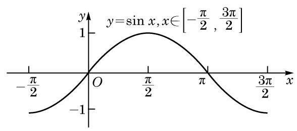

# 概念卡：(4)单调性

由于正弦函数是以 ${2\pi }$ 为最小正周期的周期函数,因此在研究它的单调区间时,只需选择一个长度为 ${2\pi }$ 的合适的区间进行考察. 方便起见,我们可以在 $\left\lbrack  {-\frac{\pi }{2},\frac{3\pi }{2}}\right\rbrack$ 上研究正弦函数 $y = \sin x$ 的单调性.

观察函数 $y = \sin x, x \in  \left\lbrack  {-\frac{\pi }{2},\frac{3\pi }{2}}\right\rbrack$ 的图像 (图 7-1-8),可以看到: 当 $x$ 由 $- \frac{\pi }{2}$ 增大到 $\frac{\pi }{2}$ 时,曲线上升, $\sin x$ 的值随着 $x$ 的增大而增大,由 -1 增大到 1 ; 而当 $x$ 由 $\frac{\pi }{2}$ 增大到 $\frac{3\pi }{2}$ 时,曲线下降, $\sin x$ 的值随着 $x$ 的增大而减小,由 1 减小到 -1 .

这就是说,正弦函数 $y = \sin x$ 在 $\left\lbrack  {-\frac{\pi }{2},\frac{\pi }{2}}\right\rbrack$ 上是严格增函数; 在 $\left\lbrack  {\frac{\pi }{2},\frac{3\pi }{2}}\right\rbrack$ 上是严格减函数.

由于正弦函数 $y = \sin x$ 的最小正周期是 ${2\pi }$ ,因此正弦函数 $y = \sin x$ 在 $\left\lbrack  {{2k\pi } - \frac{\pi }{2},{2k\pi } + \frac{\pi }{2}}\right\rbrack  \left( {k \in  \mathbf{Z}}\right)$ 上是严格增函数; 在 $\left\lbrack  {{2k\pi } + \frac{\pi }{2},{2k\pi } + \frac{3\pi }{2}}\right\rbrack  \left( {k \in  \mathbf{Z}}\right)$ 上是严格减函数.

---

在图 7-1-6 中, 因为在单位圆上, 当 $x$ 由 $- \frac{\pi }{2}$ 增大到 $\frac{\pi }{2}$ 时,点 $P$ 的纵坐标 $v$ 由 -1 增大到 1 , 且 $\sin x = v$ ,所以 $\sin x$ 的值由 -1 增大到 1 .

---
