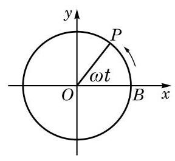
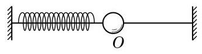

# 概念卡：课后阅读

##### 圆周运动与简谐运动

一个质量为 $m$ 的质点绕点 $O$ 按逆时针方向做匀速圆周运动. 设圆的半径为 $r$ ,而质点运动的角速度为 $\omega$ . 以圆心 $O$ 为坐标原点,圆心 $O$ 与质点的初始位置 $B$ 的连线为 $x$ 轴,建立如图 7-1-9 所示的平面直角坐标系. 经过一段时间 $t$ ,该质点沿圆周从点 $B$ 运动到点 $P\left( {x, y}\right)$ . 由于 ${OP}$ 为角 ${\omega t}$ 的终边,由正弦和余弦的定义,有 $\left\{  \begin{array}{l} x = r\cos {\omega t}, \\  y = r\sin {\omega t}. \end{array}\right.$ 这说明匀速圆周运动在水平方向和竖直方向的投影分别按余弦规律和正弦规律随时间 $t$ 而变化.

从物理学知识知道,质点做匀速圆周运动所需要的向心力的大小是 ${mr}{\omega }^{2}$ ,方向指向

圆心. 向心力的竖直分力为 ${F}_{y} =  - {mr}{\omega }^{2}\sin {\omega t} =  - m{\omega }^{2}y$ . 记常数 $k = m{\omega }^{2}$ ,就有 ${F}_{y} =  - {ky}$ ,从而质点所受合力的竖直分力与竖直位移成正比且方向相反, 这正和简谐运动中质点 (如图 7-1-10 中连接在弹簧上的小球) 的受力情况相仿. 由此类比, 我们知道匀速圆周运动在竖直方向上的投影就是一个简谐运动,它的位移随时间的变化关系为 $y = A\sin {\omega t}$ . 更一般地,如果不要求 $t = 0$ 时 $y = 0$ ,就有 $y = A\sin \left( {{\omega t} + \varphi }\right)$ .

