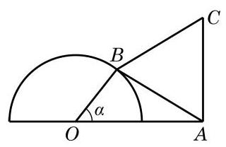
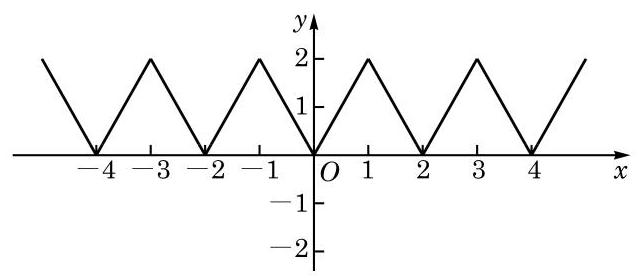

# 方法卡：习题 7.1

##### A 组

1. 作出下列函数的大致图像:

(1) $y = 1 + \sin x, x \in  \left\lbrack  {0,{2\pi }}\right\rbrack$ ； (2) $y = \left| {\sin x}\right| , x \in  \mathbf{R}$ .

2. 求下列函数的最小正周期:

(1) $y = 1 + \sin \frac{2}{7}x, x \in  \mathbf{R}$ ； (2) $y = \frac{1}{3}\sin \left( {-{3x} + \frac{\pi }{3}}\right) , x \in  \mathbf{R}.$

3. 已知函数 $y = 2\sin \left( {{2\omega x} - \frac{\pi }{4}}\right)$ (其中常数 $\omega  \neq  0$ )的最小正周期为 2，求 $\omega$ 的值.

4. 求下列函数的最大值和最小值,并指出使其取得最大值和最小值时的所有 $x$ 值的集合:

(1) $y = 2 - 3\sin x, x \in  \mathbf{R}$ ; (2) $y =  - {\sin }^{2}x + 2\sin x + 2, x \in  \mathbf{R}$ ；

(3) $y = 2\sin x - 5, x \in  \left\lbrack  {-\frac{\pi }{3},\frac{5\pi }{6}}\right\rbrack$ ；___ (4) $y = {\cos }^{2}x - \sin x, x \in  \mathbf{R}$ .

5. 判断下列函数的奇偶性, 并说明理由:

(1) $y =  - 2\sin x$ ； (2) $y = \frac{\sin x}{x}$ ；___ (3) $y = \frac{x}{1 + \sin x}$ .

6. 利用函数的单调性, 比较下列各组数的大小:

(1) $\sin \frac{3\pi }{11}$ 与 $\sin \frac{5\pi }{12}$ ； (2) $\sin \left( {-\frac{76\pi }{11}}\right)$ 与 $\sin \frac{85\pi }{12}$ .

7. 求下列函数的单调区间:

(1) $y = 2 - \sin x$ ； (2) $y = 3\sin \left( {\frac{x}{3} + \frac{\pi }{4}}\right)$ .

8. 求下列函数的值域:

(1) $y = 3\sin x + \sqrt{3}\cos x$ ； (2) $y = {\sin }^{2}x + 4\sin x$ .

9. 求函数 $y = 2\sin x - 1$ 的零点.

##### B 组

1. 可以利用正弦函数 $y = \sin x$ 和 $y = \frac{1}{2}$ 的图像,并结合正弦函数的周期性来求解不等式 $\sin x \geq  \frac{1}{2}$ . 请根据上述方法求函数 $y = \sqrt{2\sin x - 1}$ 的定义域.

2. 求函数 $y = \sin \frac{x}{2} + \cos \frac{x}{2}$ 的单调减区间.

3. 已知函数 $y = \frac{\sqrt{3}}{2}\sin {2kx} + {\cos }^{2}{kx}$ (其中常数 $k > 0$ ) 的最小正周期为 $\pi$ ,求 $k$ 的值.

4. 求函数 $y = \sin \left( {x + \frac{\pi }{6}}\right) , x \in  \left\lbrack  {-\frac{\pi }{3},\frac{\pi }{2}}\right\rbrack$ 的值域.

5. 求函数 $y = {\sin }^{4}x + {\cos }^{4}x$ 的最小正周期与最值.

6. 设半圆 $O$ 的直径为 2,而 $A$ 为直径延长线上的一点,且 ${OA} = 2$ . 对半圆上任意给定的一点 $B$ ,以 ${AB}$ 为一边作等边三角形 ${ABC}$ ,使 $\bigtriangleup {ABC}$ 和 $\bigtriangleup {ABO}$ 在 ${AB}$ 的两侧 (如图所示). 求四边形 ${OACB}$ 面积的最大值,并求使四边形 ${OACB}$ 面积取得最大值时的 $\angle {AOB}$ 的大小.

(第 6 题)

(第 7 题)

7. 如图,函数 $y = f\left( x\right) \left( {x \in  \mathbf{R}}\right)$ 的图像由折线段组成,且当 $x$ 取偶数时,对应的 $y$ 的值为 0 ; 而当 $x$ 取奇数时,对应的 $y$ 的值为 2 .

(1)写出函数 $y = f\left( x\right)$ 的最小正周期；

(2)作出函数 $y = f\left( {x - 1}\right)$ 的图像.
