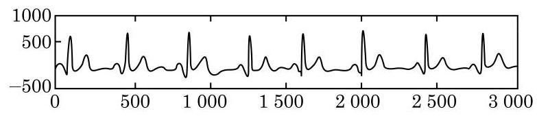

# 练习卡：练习 7.1(2)

1. 求下列函数的最小正周期:

(1) $y =  - \frac{1}{3}\sin x + 1$ ； (2) $y = 3\sin \left( {{3x} - \frac{\pi }{6}}\right)$ .

2. 当 $x = {2k\pi } + \frac{4\pi }{3}\left( {k \in  \mathbf{Z}}\right)$ 时， $\sin \left( {x + \frac{\pi }{3}}\right)  = \sin x$ 是否成立？如果成立，那么 $\frac{\pi }{3}$ 是不是 $y = \sin x$ 的周期? 为什么?

3. 现实生活中常碰到类似于周期的现象. 根据图中标出的尺度估算下列心电图的周期. (其中横轴的单位是 $2\mathrm{{ms}},1\mathrm{s} = {1000}\mathrm{{ms}}$ ; 纵轴的单位是 $\mathrm{{mV}}$ )

(第 3 题)

由于正弦函数是周期函数, 因此研究它的最值和单调性等性质时, 都可以在长度为一个周期的区间上进行.
