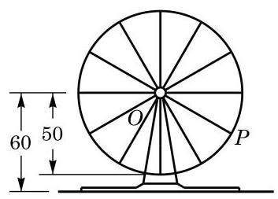

# 概念卡：B 组

1. 求函数 $y = \sin \left( {{2x} - \frac{\pi }{4}}\right)  - 2\sqrt{2}{\sin }^{2}x$ 的最小正周期.

2. 在 $\left( {0,{2\pi }}\right)$ 内,求使 $\sin x > \cos x$ 成立的 $x$ 的取值范围.

3. 求下列函数的最大值,并求出取得最大值时所有 $x$ 的值:

(1) $y = 2{\sin }^{2}x + \sin {2x} - 1$

(2) $y = 1 - \sin x - 2{\cos }^{2}x, x \in  \left\lbrack  {\frac{\pi }{3},\frac{4\pi }{3}}\right\rbrack$ .

4. 若函数 $y = 2\sin {\omega x}$ (其中常数 $\omega$ 是小于 1 的正数) 在区间 $\left\lbrack  {0,\frac{\pi }{3}}\right\rbrack$ 上的最大值是 $\sqrt{2}$ , 求 $\omega$ 的值.

5. 如图，摩天轮上一点 $P$ 距离地面的高度 $y$ 关于时间 $t$ 的函数表达式为 $y = A\sin \left( {{\omega t} + \varphi }\right)  + b,\varphi  \in  \left\lbrack  {-\pi ,\pi }\right\rbrack$ . 已知摩天轮的半径为 ${50}\mathrm{\;m}$ ,其中心点 $O$ 距地面 ${60}\mathrm{\;m}$ ,摩天轮以每 30 分钟转一圈的方式做匀速转动,而点 $P$ 的起始位置在摩天轮的最低点处.

(第 5 题)

(1)根据条件具体写出 $y\left( \mathrm{m}\right)$ 关于 $t\left( \mathrm{{min}}\right)$ 的函数表达式;

(2)在摩天轮转动的一圈内,点 $P$ 有多长时间距离地面超过 ${85}\mathrm{\;m}$ ?

*6. 说明: 用上一章 6.3 节给出的记号 arcsin 与 arccos(见第 45 页), 可以定义函数

$$
y = \arcsin x\left( {x \in  \left\lbrack  {0,1}\right\rbrack  }\right) \text{ 与 }y = \arccos x\left( {x \in  \left\lbrack  {0,1}\right\rbrack  }\right) .
$$

验证:

(1)函数 $y = \sin x\left( {x \in  \left\lbrack  {0,\frac{\pi }{2}}\right\rbrack  }\right)$ 与函数 $y = \arcsin x\left( {x \in  \left\lbrack  {0,1}\right\rbrack  }\right)$ 互为反函数；

(2)函数 $y = \cos x\left( {x \in  \left\lbrack  {0,\frac{\pi }{2}}\right\rbrack  }\right)$ 与函数 $y = \arccos x\left( {x \in  \left\lbrack  {0,1}\right\rbrack  }\right)$ 互为反函数.

*7. 把上题的记号略作推广: 对实数 $x \in  \left\lbrack  {-1,1}\right\rbrack$ , 若实数 $y \in  \left\lbrack  {-\frac{\pi }{2},\frac{\pi }{2}}\right\rbrack$ 使得 $\sin y = x$ ,则记 $y = \arcsin x$ ; 类似地,对实数 $x \in  \left\lbrack  {-1,1}\right\rbrack$ ,若实数 $y \in  \left\lbrack  {0,\pi }\right\rbrack$ 使得 $\cos y \; = x$ ,则记 $y = \arccos x$ . 说明: 经过推广的记号 arcsin 与 $\arccos$ ,定义了函数 $y = \arcsin x\left( {x \in  \left\lbrack  {-1,1}\right\rbrack  }\right)$ 与 $y = \arccos x\left( {x \in  \left\lbrack  {-1,1}\right\rbrack  }\right)$ .

---

函数 $y = \arcsin x\left( {x \in  \left\lbrack  {-1,1}\right\rbrack  }\right)$ 、 $y = \arccos x\left( {x \in  \left\lbrack  {-1,1}\right\rbrack  }\right)$ 与 $y = \; \arctan x\left( {x \in  \left( {-\infty , + \infty }\right) }\right)$ 分别称为反正弦函数、反余弦函数与反正切函数. 这些函数统称为反三角函数.

---

验证:

(1)函数 $y = \sin x\left( {x \in  \left\lbrack  {-\frac{\pi }{2},\frac{\pi }{2}}\right\rbrack  }\right)$ 与函数 $y = \arcsin x(x \in  \left\lbrack  {-1,1}\right\rbrack$ ) 互为反函数;

(2)函数 $y = \cos x\left( {x \in  \left\lbrack  {0,\pi }\right\rbrack  }\right)$ 与函数 $y = \arccos x\left( {x \in  \left\lbrack  {-1,1}\right\rbrack  }\right)$ 互为反函数.

*8. 对 $y = \tan x$ 与 $y = \arctan x$ 做类似的工作.
