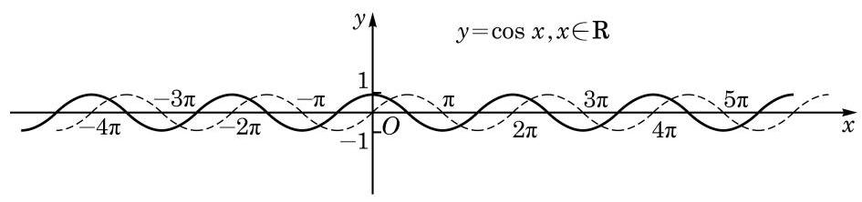

# 概念卡：1 余弦函数的图像

怎样作余弦函数 $y = \cos x$ 的图像呢?

当然,我们可以像对正弦函数 $y = \sin x$ 一样,把任意角 $x$ 的余弦值 $\cos x$ 用角的终边与单位圆的交点的横坐标表示,用描点法作出余弦函数的图像.

但是,由于已经知道了正弦函数 $y = \sin x$ 的图像,我们可以简便地利用余弦函数与正弦函数的关系来作出余弦函数的图像. 事实上,由于 $\cos x = \sin \left( {x + \frac{\pi }{2}}\right)$ 对任意的 $x \in  \mathbf{R}$ 都成立,因此余弦函数 $y = \cos x$ 与函数 $y = \sin \left( {x + \frac{\pi }{2}}\right)$ 是同一个函数,从而它们的图像相同. 由于将正弦函数 $y = \sin x$ 的图像向左平移 $\frac{\pi }{2}$ 就得到函数 $y = \sin \left( {x + \frac{\pi }{2}}\right)$ 的图像,即 $y = \cos x$ 的图像 (图 7-2-1). 余弦函数的图像通常称为余弦曲线.

观察余弦函数的图像, 并对比正弦曲线, 可知余弦曲线在区间 $\left\lbrack  {0,{2\pi }}\right\rbrack$ 上的五个关键点的坐标是 $\left( {0,1}\right) \text{ 、 }\left( {\frac{\pi }{2},0}\right) \text{ 、 }\left( {\pi , - 1}\right)$ 、

---

如图, 拨动弹簧片后，弹簧片端点离开平衡位置的位移 $s$ 随时间 $t$ 呈余弦曲线的变化规律.

---

$\left( {\frac{3\pi }{2},0}\right) \text{ 、 }\left( {{2\pi },1}\right)$ .
