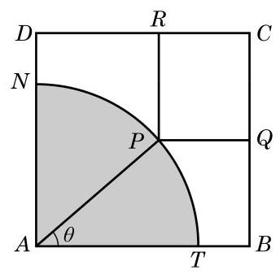

# 概念卡：拓展与思考

1. 定义在区间 $\left( {0,\frac{\pi }{2}}\right)$ 上的函数 $y = 6\cos x$ 的图像与 $y = 5\tan x$ 的图像的交点为 $P$ ,过点 $P$ 作垂直于 $x$ 轴的垂线 $P{P}_{1}$ ,其垂足为 ${P}_{1}$ . 设直线 $P{P}_{1}$ 与 $y = \sin x$ 的图像交于点 ${P}_{2}$ , 求线段 ${P}_{1}{P}_{2}$ 的长.

2. 已知定义在 $\mathbf{R}$ 上的偶函数 $y = f\left( x\right)$ 的最小正周期为 2,当 $0 \leq  x \leq  1$ 时, $f\left( x\right)  = x$ .

(1)求当 $5 \leq  x \leq  6$ 时函数 $y = f\left( x\right)$ 的表达式；

(2)若函数 $y = {kx}, x \in  \mathbf{R}$ 与函数 $y = f\left( x\right)$ 的图像恰有 7 个不同的交点，求 $k$ 的值.

(第 3 题)

3. 如图，有一块边长为3m的正方形铁皮 ${ABCD}$ ，其中阴影部分 ${ATN}$ 是一个半径为 $2\mathrm{\;m}$ 的扇形. 设这个扇形已经腐蚀不能使用, 但其余部分均完好. 工人师傅想在未被腐蚀的部分截下一块其边落在 ${BC}$ 与 ${CD}$ 上的矩形铁皮 ${PQCR}$ ,使点 $P$ 在弧 ${TN}$ 上. 设 $\angle {TAP} = \theta$ ,矩形 ${PQCR}$ 的面积为 $S{\mathrm{\;m}}^{2}$ .

(1)求 $S$ 关于 $\theta$ 的函数表达式；

(2)求 $S$ 的最大值及 $S$ 取得最大值时 $\theta$ 的值.
