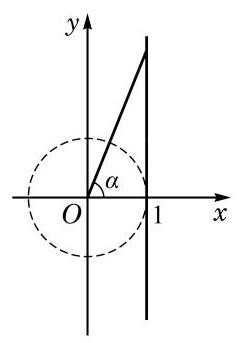
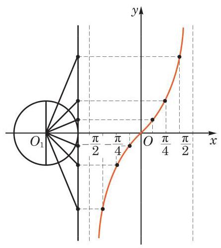
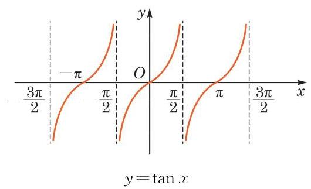

# 方法卡：1 正切函数的图像

我们知道,正切值 $\tan \alpha$ 可以用角 $\alpha$ 的终边所在直线与直线 $x = 1$ 的交点的纵坐标表示(图 7-4-1).

类似于作正弦函数图像的方法, 利用单位圆并结合描点法我们可以作出 $y = \tan x, x \in  \left( {-\frac{\pi }{2},\frac{\pi }{2}}\right)$ 的大致图像 (图 7-4-2).

因为 $\tan \left( {x + {k\pi }}\right)  = \tan x, k \in  \mathbf{Z}$ ,所以函数 $y = \tan x$ 当 $x \in  \left( {\frac{\pi }{2},\frac{3\pi }{2}}\right) , x \in  \left( {\frac{3\pi }{2},\frac{5\pi }{2}}\right) ,\cdots$ 时的图像与 $y = \tan x$ , $x \in  \left( {-\frac{\pi }{2},\frac{\pi }{2}}\right)$ 的图像形状一样,只需将后者图像的位置向右平移 $\pi \text{ 、 }{2\pi }\text{ 、 }\cdots$ 就可得到; 同理,函数 $y = \tan x$ 当 $x \in  \left( {-\frac{3\pi }{2}, - \frac{\pi }{2}}\right)$ , $x \in  \left( {-\frac{5\pi }{2}, - \frac{3\pi }{2}}\right) ,\cdots$ 时的图像与 $y = \tan x, x \in  \left( {-\frac{\pi }{2},\frac{\pi }{2}}\right)$ 的图像形状也一样,只需将后者图像的位置向左平移 $\pi \text{ 、 }{2\pi }\text{ 、 }\cdots$ 就可得到. 这样,就可以得到函数 $y = \tan x$ 的整个图像 (图 7-4-3).

因为 $y = \tan x$ 的定义域是 $\left\{  {x\left| {\;x \in  \mathbf{R}, x \neq  {k\pi } + \frac{\pi }{2}\left( {k \in  \mathbf{Z}}\right) }\right. }\right\}$ , 其图像由无穷多支曲线所组成,它们被直线 $x =  \pm  \frac{\pi }{2}, x =  \pm  \frac{3\pi }{2}$ , $x =  \pm  \frac{5\pi }{2},\cdots$ 即 $x = {k\pi } + \frac{\pi }{2}\left( {k \in  \mathbf{Z}}\right)$ 所隔开.
