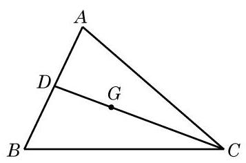
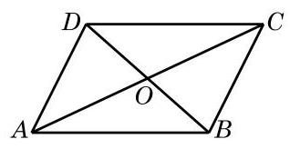

# 例题卡：例 2 已知 $\bigtriangleup {ABC}$ 三个顶点 $A\text{ 、 }B\text{ 、 }C$ 的坐标分别是 $\left( {{x}_{1},{y}_{1}}\right) \text{ 、 }\left( {{x}_{2},{y}_{2}}\right) \text{ 、 }\left( {{x}_{3},{y}_{3}}\right)$ ,求此三角形重心 $G$ 的坐标.

例 2 已知 $\bigtriangleup {ABC}$ 三个顶点 $A\text{ 、 }B\text{ 、 }C$ 的坐标分别是 $\left( {{x}_{1},{y}_{1}}\right) \text{ 、 }\left( {{x}_{2},{y}_{2}}\right) \text{ 、 }\left( {{x}_{3},{y}_{3}}\right)$ ,求此三角形重心 $G$ 的坐标.

解 如图 8-4-1,由于点 $G$ 是 $\bigtriangleup {ABC}$ 的重心,因此 ${CG}$ 与 ${AB}$ 的交点 $D$ 是 ${AB}$ 的中点,于是点 $D$ 的坐标为 $\left( \frac{{x}_{1} + {x}_{2}}{2}\right.$ , $\left. \frac{{y}_{1} + {y}_{2}}{2}\right)$

设 $G$ 的坐标为 $\left( {x, y}\right)$ ,因为 $\overrightarrow{CG} = 2\overrightarrow{GD}$ ,所以由上述定比分点公式, 得

$$
\left\{  \begin{array}{l} x = \frac{{x}_{3} + 2 \cdot  \frac{{x}_{1} + {x}_{2}}{2}}{1 + 2}, \\  y = \frac{{y}_{3} + 2 \cdot  \frac{{y}_{1} + {y}_{2}}{2}}{1 + 2}. \end{array}\right.
$$

整理, 得

$$
\left\{  \begin{array}{l} x = \frac{{x}_{1} + {x}_{2} + {x}_{3}}{3}, \\  y = \frac{{y}_{1} + {y}_{2} + {y}_{3}}{3}. \end{array}\right.
$$

这就是 $\bigtriangleup {ABC}$ 重心 $G$ 的坐标.

