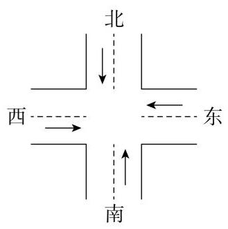

# 概念卡：构建模型

考虑一个十字路口, 其东西方向和南北方向分别只有一对相向的直行车道 (假设 1 ，如图 1-1). 由于主要考虑红绿灯时间的设置对车辆通行的影响，可忽略其他一些次要因素(假设 2 和假设 3). 又为了方便起见, 假设车流量是均匀、稳定的 (假设 4). 这里的车流量是指单位时间内通过某路段的车辆数. 不同路口红绿灯的最小周期通常是不相同的, 为了便于分析比较, 将路口红绿灯变化的最小周期取作单位时间(假设 5 ).

将我们所作的简化假设完整地列出来, 如下:

假设 1: 每个行车方向只有一条车道, 车辆不能转弯;

假设 2: 不考虑路口行人和非机动车辆的影响;

假设 3: 忽略黄灯的影响;

假设 4: 两个方向的车流量均是稳定和均匀的;

假设 5 : 将交通信号灯转换的最小周期(简称周期)取作单位时间 1 .

记单位时间内从东西方向到达十字路口的车辆数为 $H$ ,从南北方向到达十字路口的车辆数为 $V$ . 在一个周期内,假设东西方向开红灯、南北方向开绿灯的时间为 $R$ ,那么在该时间段内,东西方向开绿灯、南北方向开红灯的时间为 $1 - R$ .

我们要确定交通灯的控制方案,就是要确定 $R$ ,使得在一个周期内,车辆在路口的总滞留时间最短. 一辆车在路口的滞留时间包括两个部分:一部分是遇红灯后的停车等待时间; 另一部分是停车后司机见到绿灯重新发动到开动的时间,称为启动时间,记为 $S$ ,它是可以测定的.

由于在一个周期内,从东西方向到达路口的车辆为 $H$ 辆,该周期内东西方向开红灯的比例为 $R : 1$ ,因此需停车等待的车辆共 ${HR}$ 辆. 这些车辆等待信号灯改变的时间有的较短,有的较长,它们的平均等待时间为 $\frac{R}{2}$ . 所以,东西方向行驶的车辆在此周期内等待时间的总和为

$$
{HR} \cdot  \frac{R}{2} = \frac{H{R}^{2}}{2};
$$

①

同理, 南北方向行驶的车辆在此周期内等待时间的总和为

$$
\frac{V{\left( 1 - R\right) }^{2}}{2}\text{ . }
$$

②

凡遇红灯停车的车辆均需 $S$ 单位的启动时间. 在此周期内,各方向遇红灯停车的车辆总和为 ${HR} + V\left( {1 - R}\right)$ ,而相应的启动时间为

$$
S\left\lbrack  {{HR} + V\left( {1 - R}\right) }\right\rbrack  \text{ . }
$$

③

由①一③，可得在此周期内所有过此路口的车辆的总滞留时间为

$$
T = T\left( R\right)  = \frac{H{R}^{2}}{2} + \frac{V{\left( 1 - R\right) }^{2}}{2} + S\left\lbrack  {{HR} + V\left( {1 - R}\right) }\right\rbrack
$$

$$
= \frac{H + V}{2}{R}^{2} - \left\lbrack  {V\left( {1 + S}\right)  - {HS}}\right\rbrack  R + {SV} + \frac{V}{2}.
$$

④

这样,红绿灯控制问题的数学模型为: 求 $R$ ,使得由④式定义的 $T\left( R\right)$ 达到最小.
