# 概念卡：分析模型

从两个模型容易看出 (见③式和④式)，在同样的转角或同样的转弯半径下，轴距 $l$ 越大, 内轮差越大. 特别地, ③式表明, 内轮差的大小与车辆的轴距成正比. 这说明, 长车 (大型车辆)在转弯时形成的内轮差比短车(小型车辆)要大很多. 因此，在大型车辆转弯时, 行人和非机动车不要过于靠近汽车, 尤其是绝对不要靠近后内轮, 以避免事故的产生.

从两个模型还可以看出, 当车辆的轴距不能改变时, 车辆转弯时的转角越大, 内轮差越大(见③式)，也就是车辆的转弯半径越小，内轮差越大(见⑤式). 当然，车辆不转弯时,内轮差为 0,这可以从③式推出 (此时 $\delta  = 0$ ),也可以从⑤式推出 (因为此式表明，当 ${R}_{1}$ 趋于无穷大时,内轮差趋于 0 ). 这一结论给我们的启示是,驾驶员 (尤其是大型车辆的驾驶员)在驾驶车辆拐弯时，一定要有内轮差意识:道路条件许可时，尽量加大转弯半径； 由于道路条件不许可而不得不作急转弯(例如在交叉路口的右转弯)时，应特别注意减速慢行, 密切观察路况, 避免内轮差造成的伤害事故.

我们还得关注一下车身比较宽的车辆. ④式和⑤式中用的参数不是车辆的转弯半径 $R$ ,而是后内轮的转弯半径 ${R}_{1} = R - \frac{w}{2}$ (其中 $w$ 是轮距,基本上可以看成车的宽度). 因此, 在同样的转弯半径下, 较宽车辆的后内轮转弯半径比较小, 从而会产生比较大的内轮差. 这也是值得注意的.

为了验证转弯半径、轮距、轴距对内轮差的影响，我们用图形计算器模拟了车辆转弯时的情形，并用来检验前面得到的模型.

为了研究的方便, 我们忽略了前轮轮胎到车头、后轮轮胎到车尾的部分. 将车辆近似看成一个矩形, 车轮安装在车头和车尾两侧部分 (图 3-4 至图 3-7).

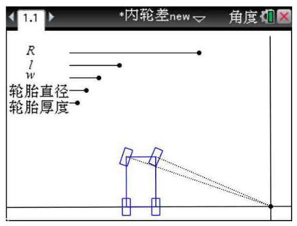

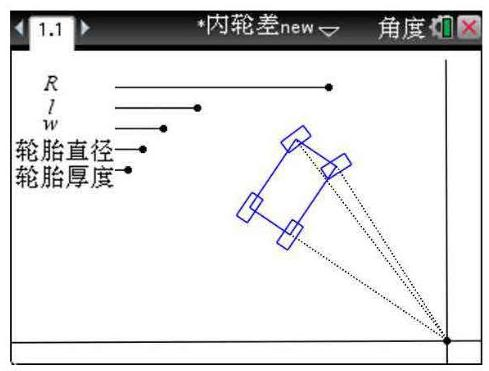

图 3-4 图 3-5

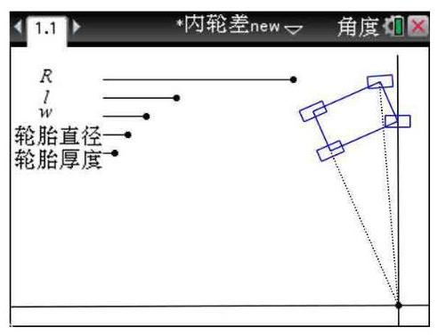

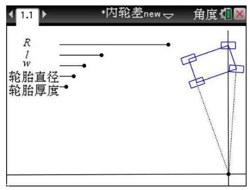

图 3-6 图 3-7

设置动态演示, 我们得到了四个车轮的行驶轨迹 (图 3-8 至图 3-12).

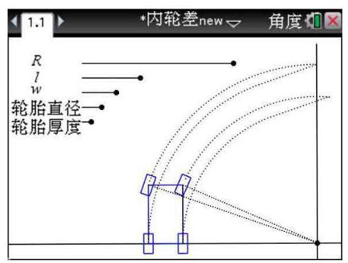

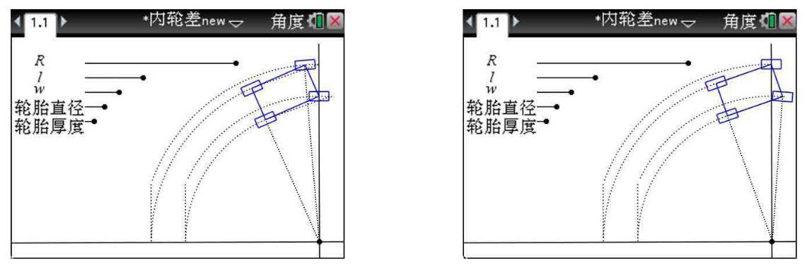

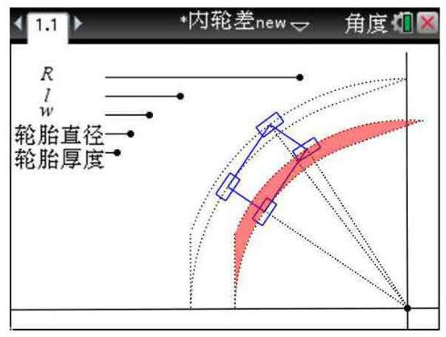

通过实验模拟以及数据计算可以发现, 在每次只改变一个参数、而其余参数不变的情况下, 有如下结论:

(1)转弯半径越小, 内轮差越大 (比较图 3-13、图 3-14);

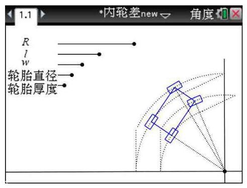

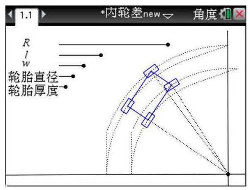

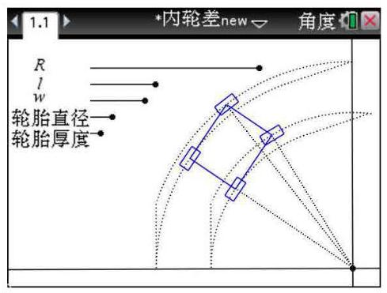

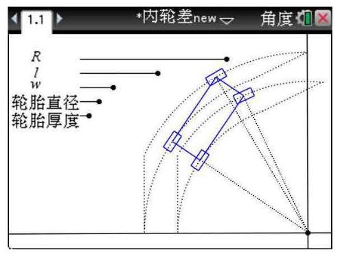

(2)轮距(与车身宽度有关)越大，内轮差越大(比较图 3-14、图3-15)；

(3)轴距(与车身长度有关)越大，内轮差越大(比较图 3-14、图 3-16).

这些模拟实验的结论与我们前面建立的内轮差模型的结果基本吻合.
