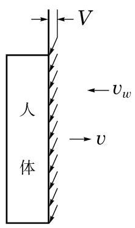

# 概念卡：模型的改进

初步模型只考虑了降雨时头顶被雨淋湿的情形, 请参考苏联趣味科学大师别莱利曼 (Y. I. Perelman)在《趣味力学》一书中介绍的类似的趣味问题. 根据生活经验, 人在雨中行走时，不仅头顶会被雨淋湿，其前后左右的衣服通常也会被淋湿. 因此，我们需要对初步模型作进一步的改进.

基于上述判断, 你能对初步模型作出适当的改进吗? 请将你的改进模型填入下框.

要计算前后衣服的淋雨量, 就要考虑风相对于行走的方向. 如果风是迎面吹来的, 那么被雨淋湿的部位就只有头顶和身体前部. 这样, 雨滴相对于人体的水平速度大小为 $V = {v}_{w} + v$ ,单位时间内身体前部淋到的雨包含在一个倾斜的平行六面体中,其底面为身体前部,面积为 ${wh}$ ,高等于 $V$ (图 4-5). 因此,单位时间内身体前部的淋雨量为

$$
{C}_{f} = {pwhV} = {pwh}\left( {{v}_{w} + v}\right) .
$$

⑤

而行走时间为

$$
t = \frac{D}{v}
$$

所以，身体前部总的淋雨量为

$$
{T}_{f} = \frac{p{wh}D}{v}\left( {{v}_{w} + v}\right) .
$$

这样, 人体总的淋雨量为

$$
T = {T}_{h} + {T}_{f} = \frac{pwD}{v}\left\lbrack  {d{v}_{r} + h\left( {{v}_{w} + v}\right) }\right\rbrack  .
$$

⑥
