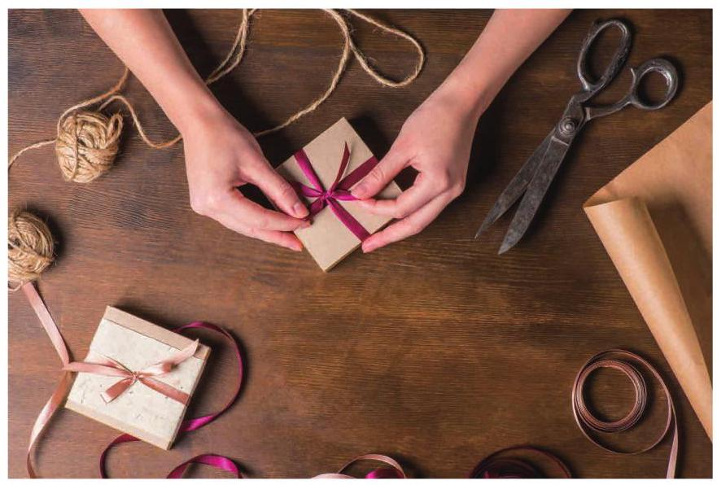

# 方法卡：8 包装彩带

按照中国的传统习俗, 走亲访友会带上一些朋友喜欢的礼物, 可能是一盒点心、一本书或一个玩具等. 一般来说, 我们不仅会用包装纸把礼物包好, 还会用彩带捆扎包装好的礼物，有时还会扎出一个花结. 其实，这些精美的包装彩带也不便宜，我们在捆扎时不仅要考虑美观、结实, 也要考虑尽量地节省包装彩带. 生活中, 你见到过哪些用彩带捆扎包装礼物的方法? 请推荐一种比较节省彩带的方法, 并说明你的理由.

