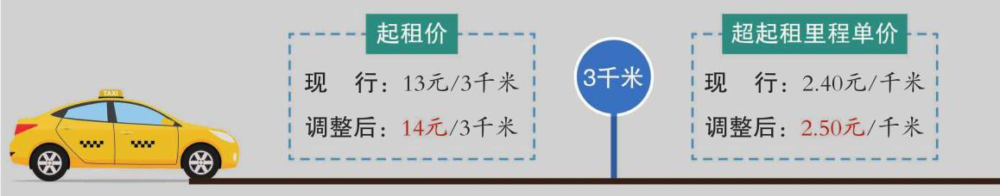

# 概念卡：5 出租车运价

某晚报曾刊登过一则生活趣事. 某市民乘坐出租车时, 在半途中要求司机临时停靠, 打表计价结账，然后重新计价，继续前行. 该市民解释说，根据经验，这样分开支付车费比一次性付费便宜一些. 他的这一说法有道理吗?

确实, 由于出租车运价上调, 有些人出行时会估计一下可能的价格, 再决定是否乘坐出租车. 据了解, 2018 年上海出租车在 5 时到 23 时之间起租价为 14 元/3 千米, 超起租里程单价为 2.50 元/千米. 总里程超过 15 千米(不含 15 千米)部分按超起租里程单价加价 50%. 低速等候费为每 4 分钟计收 1 千米超起租里程单价. 此外, 相关部门还规定了其他时段的计价办法，以及适合其他车型的计价办法.

市域出租汽车运价具体调整方案

根据市域出租汽车运价调整实施方案，起租价由13元/3千米调整为14元/3千米， 超起租里程运价由2.40元/千米调整为2.50元/千米.

你会仿效那位市民的做法吗？为什么？
