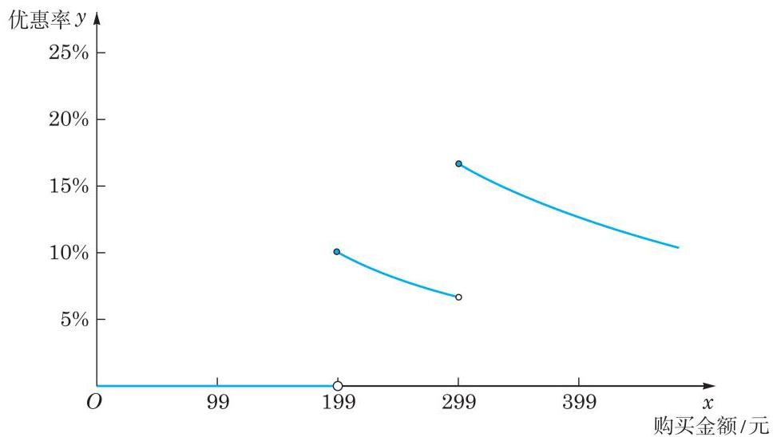

# 概念卡：四、求解与分析模型

根据上述函数关系①，作出该分段函数的图像，如图 1 所示.

图 1 购买金额与优惠率之间的函数关系

从图 1 可以看出,当 $0 < x < {199}$ 时,优惠率 ${y}_{1}$ 是常值函数, ${y}_{1} = 0\%$ ;

当 $x = {199}$ 时,优惠率 ${y}_{2} = \frac{20}{199} = {10.05}\% ,{y}_{2} > {y}_{1}$ ,因此当购买金额接近 199 元时, 可以考虑适当地“凑单”购买物品, 使得购买金额达到或少许超过 199 元, 可以享受到相应的优惠;

当 ${199} \leq  x < {299}$ 时,优惠率 ${y}_{3} = \frac{20}{x},{y}_{3}$ 是 $x$ 的严格减函数,且 ${6.69}\%  < {y}_{3} \leq$ 10.05%;

当 $x = {299}$ 时,优惠率 ${y}_{4} = \frac{50}{299} = {16.72}\% ,{y}_{4} > {y}_{3}$ ,因此当购买金额接近 299 元时, 可以考虑适当地“凑单”购买物品, 使得购买金额达到或少许超过 299 元, 从而享受到更高的优惠率. 反之, 当购买金额虽超过 199 元, 但与 299 元距离尚大时, 可以考虑适当地“减单”购买物品，使得购买金额恰好达到或少许超过 199 元，从而享受到更高的优惠率.

根据图 1, 当购买金额为 299 元时, 优惠率最高. 这说明, 商家的“满减”优惠能吸引人是有一定道理的.

从图 1 还可以看出,当 ${199} \leq  x < {299}$ 时,对于该分段区间上的函数 $y = \frac{20}{x}$ ,优惠率随着购买金额的增大而降低, 并不是买得越多, 优惠率越高. 在该区间内, 恰好“凑单” 到 199 元享受的优惠率最高,继续购买并不划算. 同理,当 $x \geq  {299}$ 时,对于相应分段区间上的函数 $y = \frac{50}{x}$ ,优惠率随着购买金额的增大而降低,同样是买得越多,优惠率越低. 在该区间内, 最佳的“凑单”方式是使购买金额刚好达到 299 元, 继续购买并不划算.
