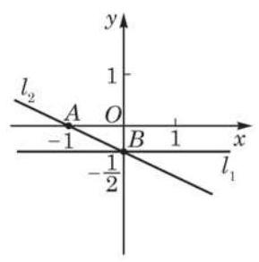

# 例题卡：例 6 在平面直角坐标系中, 根据所给直线方程, 作出相应图形,并求出该直线的斜率和在 $y$ 轴上的截距:

例 6 在平面直角坐标系中, 根据所给直线方程, 作出相应图形,并求出该直线的斜率和在 $y$ 轴上的截距:

(1) ${l}_{1} : {{2y} + 1} = 0$ ；

(2) ${l}_{2} : x + {2y} + 1 = 0$ .

解 (1) 因为 ${l}_{1} : y =  - \frac{1}{2}$ ,所以该直线过点 $B\left( {0, - \frac{1}{2}}\right)$ 且平行于 $x$ 轴 (图 1-2-4). 所以, ${l}_{1}$ 的斜率为 0 且在 $y$ 轴上的截距是 $- \frac{1}{2}$ .

(2)在方程 $x + {2y} + 1 = 0$ 中，令 $y = 0$ ，得 $x =  - 1$ ；令 $x = 0$ ， 得 $y =  - \frac{1}{2}$ . 这就得到直线 ${l}_{2}$ 上两个不同的点 $A\left( {-1,0}\right) \text{ 、 }B\left( {0, - \frac{1}{2}}\right)$ , 连接 $A\text{ 、 }B$ 两点的直线即为直线 ${l}_{2}$ (图 1-2-4).

因为方程 $x + {2y} + 1 = 0$ 可化为 $y =  - \frac{1}{2}x - \frac{1}{2}$ ,所以直线 ${l}_{2}$ 的斜率是 $- \frac{1}{2}$ ,在 $y$ 轴上的截距是 $- \frac{1}{2}$ .
