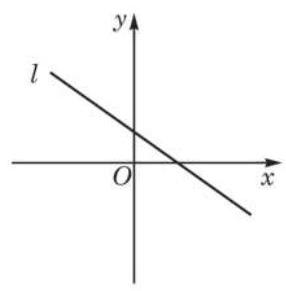

# 例题卡：例 7 已知直线 $l$ 的方程为 ${ax} + y + a + 1 = 0\left( {a \in  \mathbf{R}}\right)$ ,求证: 无论 $a$ 取何值时,直线 $l$ 都经过一个定点,并写出该定点的坐标.

例 7 已知直线 $l$ 的方程为 ${ax} + y + a + 1 = 0\left( {a \in  \mathbf{R}}\right)$ ,求证: 无论 $a$ 取何值时,直线 $l$ 都经过一个定点,并写出该定点的坐标.

解 由 ${ax} + y + a + 1 = 0$ ,变形得 $y + 1 =  - a\left( {x + 1}\right)$ . 这是直线 $l$ 的点斜式方程, $- a$ 是 $l$ 的斜率,点 $\left( {-1, - 1}\right)$ 是 $l$ 经过的定点.

所以，无论 $a$ 取何值时，直线 $l$ 都经过一个定点，该定点的坐标为 $\left( {-1, - 1}\right)$ .

