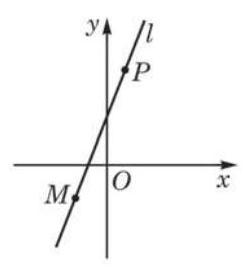
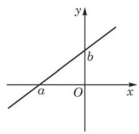

# 概念卡：(1)直线的点斜式方程

现在我们讨论, 在平面直角坐标系中, 当直线的斜率存在时,如何通过直线上的一个点 $M$ 和直线的斜率 $k$ 来求直线的方程.

如图 1-2-1,在平面直角坐标系中,设 $P\left( {x, y}\right)$ 是过点 $M\left( {{x}_{0},{y}_{0}}\right)$ 、斜率为 $k$ 的直线 $l$ 上的任意一点. 当点 $P\left( {x, y}\right)$ 与点 $M$ 不重合时,由 $k = \frac{y - {y}_{0}}{x - {x}_{0}}$ ,可得

$$
y - {y}_{0} = k\left( {x - {x}_{0}}\right) .
$$

①

当点 $P\left( {x, y}\right)$ 与点 $M$ 重合时,点 $P$ 的坐标就是 $\left( {{x}_{0},{y}_{0}}\right)$ ,同样满足方程①. 这样,直线 $l$ 上任意一点的坐标 $\left( {x, y}\right)$ 都满足方程①.

反之,可以证明以方程①的解为坐标的点一定在这条直线 $l$ 上: 若点 $Q$ 的坐标 $\left( {{x}^{\prime },{y}^{\prime }}\right)$ 满足方程①,即 ${y}^{\prime } - {y}_{0} = k\left( {{x}^{\prime } - {x}_{0}}\right)$ 成立. 当 ${x}^{\prime } \neq  {x}_{0}$ 时,直线 ${MQ}$ 经过点 $M$ 且斜率 ${k}_{MQ} = \frac{{y}^{\prime } - {y}_{0}}{{x}^{\prime } - {x}_{0}} = k$ , 于是直线 ${MQ}$ 与 $l$ 重合,从而点 $Q$ 在 $l$ 上; 当 ${x}^{\prime } = {x}_{0}$ 时,有 ${y}^{\prime } = {y}_{0}$ ,点 $Q$ 与点 $M$ 重合,点 $Q$ 也在 $l$ 上.

这就证明了方程①是经过定点 $M\left( {{x}_{0},{y}_{0}}\right)$ 且斜率为 $k$ 的直线的方程. 这种形式的直线方程叫做直线的点斜式方程.

---

本章 1.1 节中例 3 得到的方程就是一个点斜式方程.

---

在点斜式方程①中，如果把定点选成直线与 $y$ 轴的交点 $\left( {0, b}\right)$ ,那么方程改写为

$$
y = {kx} + b.
$$

②

其中，数值 $b$ 称为该直线在 $y$ 轴上的截距 (图1-2-2). 当然，直线在 $y$ 轴上的截距本质上是确定了直线上的一点 $\left( {0, b}\right)$ ,所以给定直线的斜率和在 $y$ 轴的截距,就唯一地确定了这条直线.

方程②称为直线的斜截式方程. 当 $k \neq  0$ 时，它表示 $y$ 是 $x$ 的一次函数,这个函数图像也就是我们所讨论的直线. 当 $k = 0$ 时,该直线与 $x$ 轴平行或重合,其方程为 $y = b$ .

我们也可以定义直线在 $x$ 轴上的截距,它就是直线与 $x$ 轴交点 $\left( {a,0}\right)$ 的横坐标 $a$ (图 1-2-2).

如果直线与 $y$ 轴平行或重合,它的斜率与在 $y$ 轴上的截距都不存在,但此时直线与 $x$ 轴垂直,设垂足为 $\left( {a,0}\right)$ ,那么该直线在 $x$ 轴上的截距为 $a$ ,且直线上所有点的横坐标都是 $a$ ,从而直线的方程是 $x = a$ .
