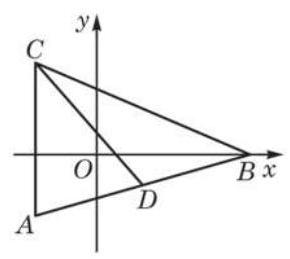

# 例题卡：例 3 已知直线 $l$ 经过点 $A\left( {2,1}\right) \text{ 、 }B\left( {4,4}\right)$ ,求 $l$ 的方程.

例 3 已知直线 $l$ 经过点 $A\left( {2,1}\right) \text{ 、 }B\left( {4,4}\right)$ ,求 $l$ 的方程.

解 直接把点 $A\text{ 、 }B$ 的坐标代入直线的两点式方程,得

$$
\frac{y - 1}{4 - 1} = \frac{x - 2}{4 - 2}
$$

化简, $l$ 的方程可写为 $y = \frac{3}{2}x - 2$ .
