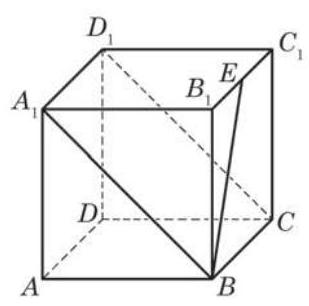

# 公式卡：3.1 空间向量及其运算

我们已经知道, 向量是既有大小又有方向的量, 它可以用有向线段来表示. 必修课程第 8 章 “平面向量” 中, 讨论的是同一个平面中的有向线段所表示的向量. 本章将去掉这一限制, 考虑可以用空间任何有向线段表示的向量.

我们可以仿照必修课程第 8 章, 对空间向量做一系列定义, 给出一系列法则, 推导一系列性质. 但这将是一个冗长而无趣的过程, 几乎原原本本地复述必修课程第 8 章前两节. 我们放弃了这样的做法, 取而代之的是把基础框架的建立尽可能地归结到平面上, 然后再探索在空间讨论向量所遇到的新问题. 归结到平面的过程也是对必修课程第 8 章的复习，为同学们进一步学习空间向量做好铺垫.

首先注意到，在必修课程第 8 章“平面向量”中，虽然仅仅讨论平面上的向量, 但许多定义都没有特别冠以“平面”二字, 有关的概念实际上都适合于本章的讨论, 这些概念包括: 向量的模、 单位向量、零向量、平行向量、相等向量、负向量等.

为进一步把空间向量问题归结到平面上讨论, 需要引入共面向量的概念: 如果一组向量可以平移到同一个平面上, 那么称这组向量是共面的. 显然, 任意两个向量都是共面的.

一组共面向量的问题都可当作平面向量来处理和讨论. 特别地, 空间中任何只涉及一个或两个向量的运算、概念和相关性质, 都可以直接运用平面向量的有关结论. 这些运算和概念包括向量的和、向量的差、实数与向量的乘法等, 与这些运算相联系的运算律也全部适用. 空间中一个向量在一个非零向量方向上的投影以及向量的夹角也可以在一个平面上实现, 所以空间向量的数量积与向量的夹角也都可以运用平面向量数量积的定义与有关的计算公式. 特别地, 空间中两向量垂直的充要条件是其数量积为零.

虽然空间向量的加法结合律涉及三个向量, 它们可能不共面, 但每一步加法都只涉及两个向量, 可以用平面向量加法法则来证明此定律成立: 先把空间任意三个向量平移为首尾相接的向量 $\overrightarrow{AB}\text{ 、 }\overrightarrow{BC}$ 与 $\overrightarrow{CD}$ ,因为 $\overrightarrow{AB}$ 与 $\overrightarrow{BC}$ 共面, $\overrightarrow{AC}$ 与 $\overrightarrow{CD}$ 共面,我们得到

$$
\left( {\overrightarrow{AB} + \overrightarrow{BC}}\right)  + \overrightarrow{CD} = \overrightarrow{AC} + \overrightarrow{CD} = \overrightarrow{AD};
$$

同理, $\overrightarrow{AB} + \left( {\overrightarrow{BC} + \overrightarrow{CD}}\right)  = \overrightarrow{AB} + \overrightarrow{BD} = \overrightarrow{AD}$ . 这就证明了空间向量的加法结合律.

有了加法结合律, 我们可以求空间向量的连加, 而不必顾及式中的括号，而且向量加法的 “首尾规则” 对空间向量依然成立:若干个起点、终点依次相接的向量的和是以第一个向量的起点为起点, 以最后一个向量的终点为终点的向量. 结合律的证明过程略加推广就证明了 “首尾规则”.

