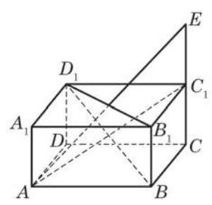

# 例题卡：例 1 如图 3-1-1,在正方体 ${ABCD} - {A}_{1}{B}_{1}{C}_{1}{D}_{1}$ 中, $E$ 为棱 ${B}_{1}{C}_{1}$ 上任意一点. 只考虑图上已作出线段所对应的向量, 分别写出:

例 1 如图 3-1-1,在正方体 ${ABCD} - {A}_{1}{B}_{1}{C}_{1}{D}_{1}$ 中, $E$ 为棱 ${B}_{1}{C}_{1}$ 上任意一点. 只考虑图上已作出线段所对应的向量, 分别写出:

(1) $\overrightarrow{AB}$ 的相等向量， $\overrightarrow{{A}_{1}B}$ 的负向量；

(2)用另外两个向量的和或差表示 $\overrightarrow{B{B}_{1}}$ ；

(3)用三个或三个以上向量的和表示 $\overrightarrow{BE}$ (举两个例子).

解(1)根据正方体棱与棱之间的关系， $\overrightarrow{AB}$ 的相等向量有 $\overrightarrow{{A}_{1}{B}_{1}}\text{ 、 }\overrightarrow{DC}\text{ 、 }\overrightarrow{{D}_{1}{C}_{1}},\overrightarrow{{A}_{1}B}$ 的负向量有 $\overrightarrow{B{A}_{1}}\text{ 、 }\overrightarrow{C{D}_{1}}$ .

(2)此小题用“首尾规则”求解. 如果只在含 $\overrightarrow{B{B}_{1}}$ 的三角形中考虑,有 $\overrightarrow{B{B}_{1}} = \overrightarrow{B{A}_{1}} + \overrightarrow{{A}_{1}{B}_{1}},\overrightarrow{B{B}_{1}} = \overrightarrow{BE} + \overrightarrow{E{B}_{1}},\overrightarrow{B{B}_{1}} = \overrightarrow{B{A}_{1}} - \overrightarrow{{B}_{1}{A}_{1}}$ , $\overrightarrow{B{B}_{1}} = \overrightarrow{BE} - \overrightarrow{{B}_{1}E}.$

如果考虑 $\overrightarrow{B{B}_{1}}$ 的相等向量所在的三角形,那么可以有更多的解答, 请同学们自行补出.

(3)此小题用“首尾规则”求解，有许多不同的答案，以下是两个例子:

$$
\overrightarrow{BE} = \overrightarrow{B{A}_{1}} + \overrightarrow{{A}_{1}{B}_{1}} + \overrightarrow{{B}_{1}E},
$$

$$
\overrightarrow{BE} = \overrightarrow{B{B}_{1}} + \overrightarrow{{B}_{1}{A}_{1}} + \overrightarrow{{A}_{1}{D}_{1}} + \overrightarrow{{D}_{1}{C}_{1}} + \overrightarrow{{C}_{1}E}\text{ . }
$$

