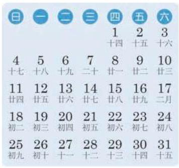
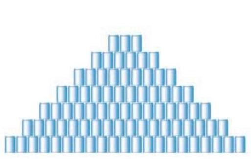

# 公式卡：1 等差数列及其通项公式

在现实生活中, 我们经常见到按一定顺序排列起来的一列数, 称之为数列. 我们将数列中的每一个数叫做这个数列的项. 排在第一位的数称为这个数列的第 1 项 (通常叫做首项), 排在第二位的数称为这个数列的第 2 项, ……, 排在第 $n$ 位的数称为这个数列的第 $n$ 项,等等.

数列的一般形式可以记成

$$
{a}_{1},{a}_{2},{a}_{3},\cdots ,{a}_{n},\cdots ,
$$

其中 ${a}_{n}$ 是数列的第 $n$ 项,下标 $n$ 是 ${a}_{n}$ 的序数. 上面的数列常简记为 $\left\{  {a}_{n}\right\}$ .

观察以下数列, 看它们有什么共同的特点.

(1)月历(图 4-1-1)最后一列数依次为:

$$
3,{10},{17},{24},{31}\text{ . }
$$

①

(2)按一定规律堆放在一起的食品罐头(图 4-1-2)，共堆放 7 层, 从下到上各层的罐头数依次为:

$$
{21},{18},{15},{12},9,6,3.
$$

②

(3)全国统一的鞋号中，常见的成年女鞋的尺寸(单位:cm) 由小至大依次为:

$$
{22.5},{23},{23.5},{24},{24.5},{25},{25.5},{26}.
$$

③

可以看到, 对于数列①, 从第 2 项起, 每一项与其前一项的差都等于 7; 对于数列②, 从第 2 项起, 每一项与其前一项的差都等于 -3 ; 对于数列③，从第 2 项起，每一项与其前一项的差都等于 0.5 .

这些数列有一个共同特点: 从第 2 项起, 每一项与其前一项的差都等于同一个常数.

定义 如果一个数列从第 2 项起, 每一项与其前一项的差都等于同一个常数, 这个数列就叫做等差数列 (arithmetic sequence), 而这个常数叫做等差数列的公差 (common difference). 公差通常用小写字母 $d$ 表示.

给定一个数列 $a, A, b$ . 若 $a, A, b$ 是等差数列,由定义可得 $A - a = b - A$ ,从而 $A = \frac{a + b}{2}$ . 反之,若 $A = \frac{a + b}{2}$ ,则 ${2A} = a + b$ ,即 $A - a = b - A$ ,从而 $a, A, b$ 成等差数列.

这时, $A$ 叫做 $a$ 与 $b$ 的等差中项.

如果等差数列 $\left\{  {a}_{n}\right\}$ 的首项为 ${a}_{1}$ ,公差为 $d$ ,由定义可得

$$
{a}_{n} - {a}_{n - 1} = d\left( {n \geq  2}\right) ,
$$

从而

$$
{a}_{2} - {a}_{1} = d,
$$

$$
{a}_{3} - {a}_{2} = d,
$$

$$
{a}_{4} - {a}_{3} = d,
$$

...

$$
{a}_{n} - {a}_{n - 1} = d\left( {n \geq  2}\right) \text{ . }
$$

把这 $\left( {n - 1}\right)$ 个等式相加得

$$
{a}_{n} - {a}_{1} = \left( {n - 1}\right) d,
$$

由此

$$
{a}_{n} = {a}_{1} + \left( {n - 1}\right) d\left( {n \geq  2}\right) .
$$

当 $n = 1$ 时,容易验证上面的等式也成立. 因此,当 $n$ 为正整数时,等差数列 $\left\{  {a}_{n}\right\}$ 的第 $n$ 项可以用如下公式表示:

$$
{a}_{n} = {a}_{1} + \left( {n - 1}\right) d.
$$

像这种用数列的序数 $n$ 表示相应项 ${a}_{n}$ 的公式称为数列 $\left\{  {a}_{n}\right\}$ 的通项公式. 而上式就是等差数列 $\left\{  {a}_{n}\right\}$ 的通项公式.
