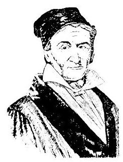
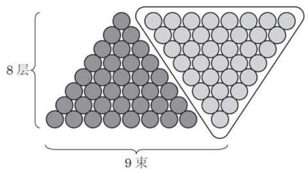

# 方法卡：2 等差数列的前 $n$ 项和

---

高斯 (C. F. Gauss, 1777—1855) 德国数学家. 研究的内容涉及数学的诸多领域, 并对天文学和大地测量学的研究有突出贡献. 他在世界上享有崇高的声望，被誉为 “数学王子”.

---

据说 200 多年前, 著名数学家高斯的算术老师在课堂上曾经提出了下面的问题:

求 $1 + 2 + 3 + \cdots  + {100}$ 的值.

少年高斯用下面的方法迅速算出了正确的答案:

$$
1 + 2 + 3 + \cdots  + {100} = ?
$$

$$
{100} + {99} + {98} + \cdots  + 1 = ?
$$

上述两式相加得: ${{101} + {101} + {101} + \cdots  + {101}} = 2 \times$ ?

所以，结果为 $\frac{{101} \times  {100}}{2} = {5050}$ .

高斯的计算方法实际上解决了求等差数列 $1,2,3,\cdots$ , $n,\cdots$ 前 100 项和的问题.

事实上, 古代的中国人和希腊人也是这么求等差数列之和的. 例如, 宋朝数学家杨辉提出了一个问题: “今有圭垛草一堆, 顶上一束，底阔八束. 问共几束？答:36 束. ”他的计算方法可以用图 4-1-3 表示.

一般地,将数列 $\left\{  {a}_{n}\right\}$ 的前 $n$ 项和记作 ${S}_{n}$ ,即

$$
{S}_{n} = {a}_{1} + {a}_{2} + \cdots  + {a}_{n - 1} + {a}_{n}.
$$

根据等差数列的通项公式, 上式可以写为

$$
{S}_{n} = {a}_{1} + \left( {{a}_{1} + d}\right)  + \cdots  + \left\lbrack  {{a}_{1} + \left( {n - 2}\right) d}\right\rbrack   + \left\lbrack  {{a}_{1} + \left( {n - 1}\right) d}\right\rbrack  \text{ . ① }
$$

受高斯算法的启示,我们又可将 ${S}_{n}$ 表示为

$$
{S}_{n} = {a}_{n} + {a}_{n - 1} + \cdots  + {a}_{2} + {a}_{1}
$$

$$
= {a}_{n} + \left( {{a}_{n} - d}\right)  + \cdots  + \left\lbrack  {{a}_{n} - \left( {n - 2}\right) d}\right\rbrack   + \left\lbrack  {{a}_{n} - \left( {n - 1}\right) d}\right\rbrack  \text{ . ② }
$$

②

由①+②, 得

$$
2{S}_{n} = \underset{n \uparrow  }{\underbrace{\left( {{a}_{1} + {a}_{n}}\right)  + \left( {{a}_{1} + {a}_{n}}\right)  + \cdots  + \left( {{a}_{1} + {a}_{n}}\right)  + \left( {{a}_{1} + {a}_{n}}\right) }}
$$

$$
= n\left( {{a}_{1} + {a}_{n}}\right) \text{ . }
$$

于是就可得到等差数列 $\left\{  {a}_{n}\right\}$ 的前 $n$ 项和公式

$$
{S}_{n} = \frac{n\left( {{a}_{1} + {a}_{n}}\right) }{2}.
$$

由于 ${a}_{n} = {a}_{1} + \left( {n - 1}\right) d$ ,上述公式又可以写作

$$
{S}_{n} = n{a}_{1} + \frac{n\left( {n - 1}\right) }{2}d.
$$

数列 $\left\{  {a}_{n}\right\}$ 的前 $n$ 项和也可记作 $\mathop{\sum }\limits_{{i = 1}}^{n}{a}_{i}$ ,即

$$
\mathop{\sum }\limits_{{i = 1}}^{n}{a}_{i} = {a}_{1} + {a}_{2} + {a}_{3} + \cdots  + {a}_{n}.
$$

其中， $\sum$ (读作 Sigma)称为求和符号，其下方的 $i = 1$ 表示 $i$ 从 1 开始取连续的整数值,而上方的 $n$ 表示 $i$ 的取值到 $n$ 结束. 这样, $\mathop{\sum }\limits_{{i = 1}}^{n}{a}_{i}$ 就表示该数列从第一项 ${a}_{1}$ 开始,连续 $n$ 项相加. 例如, $\mathop{\sum }\limits_{{i = 1}}^{n}i = 1 + 2 + 3 + \cdots  + n = \frac{n\left( {n + 1}\right) }{2}.$

此外, 根据乘法分配律可得

$$
\mathop{\sum }\limits_{{i = 1}}^{n}c{a}_{i} = c\mathop{\sum }\limits_{{i = 1}}^{n}{a}_{i}\text{ ( }c\text{ 为常数). }
$$
