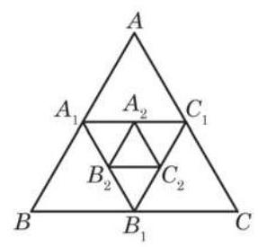

# 练习卡：练习 4.2(3)

1. 计算 $\mathop{\sum }\limits_{{i = 1}}^{{+\infty }}{\left( \frac{1}{3}\right) }^{i}$ .

2. 化下列循环小数为分数:

(1) $0.\dot{13}$ ;

(第 3 题)

(2)1.332 .

3. 如图,已知等边三角形 ${ABC}$ 的面积等于 1,连接这个三角形各边的中点得到一个小的三角形 ${A}_{1}{B}_{1}{C}_{1}$ ,又连接三角形 ${A}_{1}{B}_{1}{C}_{1}$ 各边的中点得到一个更小的三角形 ${A}_{2}{B}_{2}{C}_{2}$ ,这样的过程可以无限继续下去. 求所有三角形 ${A}_{i}{B}_{i}{C}_{i}\left( {i = 1,2,3,\cdots }\right)$ 的面积的和.
