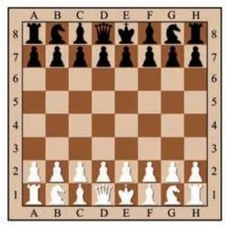

# 公式卡：2 等比数列的前 $n$ 项和

国际象棋起源于古代印度. 发明者将棋盘划分为 8 行 8 列, 构成 64 个方格. 相传国王要奖励该发明者, 问他有什么要求. 发明者说: “请在棋盘的第 1 个格子里放上 1 颗麦粒, 在第 2 个格子里放上 2 颗麦粒, 在第 3 个格子里放上 4 颗麦粒, 依次类推, 每个格子里放的麦粒数都是前一个格子里放的麦粒数的 2 倍, 直到放完 64 个格子为止. 请给我足够的麦粒以实现上述要求. ”这位发明者要了多少颗麦粒？国王能实现他的要求吗?

这实际上是求以 1 为首项、以 2 为公比的等比数列的前 64 项的和:

$$
{S}_{64} = 1 + 2 + {2}^{2} + \cdots  + {2}^{62} + {2}^{63}.
$$

如果用公比 2 乘上述等式的两边, 就得到

$$
2{S}_{64} = 2 + {2}^{2} + {2}^{3}\cdots  + {2}^{63} + {2}^{64}.
$$

可以发现, 上面两式中有许多相同的项, 两式相减可以消去这些项, 得到

$$
{S}_{64} = {2}^{64} - 1.
$$

这是一个二十位数, 将这些小麦折算成质量 (每千粒麦子的质量设为 40 $\mathrm{g}$ ),会超过 7000 亿吨. 即使到小麦年产量比较高的现代，全世界小麦年总产量也远低于 10 亿吨，国王根本满足不了发明者的要求.

一般地,设等比数列 $\left\{  {a}_{n}\right\}$ 的公比为 $q$ ,其前 $n$ 项和为

$$
{S}_{n} = {a}_{1} + {a}_{1}q + {a}_{1}{q}^{2} + \cdots  + {a}_{1}{q}^{n - 1}.
$$

将上式两边同乘公比 $q$ ,可得

$$
q{S}_{n} = {a}_{1}q + {a}_{1}{q}^{2} + {a}_{1}{q}^{3} + \cdots  + {a}_{1}{q}^{n}.
$$

将两式相减, 可得

$$
{S}_{n} - q{S}_{n} = {a}_{1} - {a}_{1}{q}^{n},
$$

即

$$
\left( {1 - q}\right) {S}_{n} = {a}_{1}\left( {1 - {q}^{n}}\right) .
$$

由此得到,当 $q \neq  1$ 时,等比数列 $\left\{  {a}_{n}\right\}$ 的前 $n$ 项和为

$$
{S}_{n} = \frac{{a}_{1}\left( {1 - {q}^{n}}\right) }{1 - q}.
$$

综上所述,可以得到以 ${a}_{1}$ 为首项、以 $q\left( {q \neq  1}\right)$ 为公比的等比数列的前 $n$ 项和公式为

$$
{S}_{n} = \frac{{a}_{1}\left( {1 - {q}^{n}}\right) }{1 - q}\left( {q \neq  1}\right) .
$$

因为 ${a}_{n} = {a}_{1}{q}^{n - 1}$ ,所以上式又可写为

$$
{S}_{n} = \frac{{a}_{1} - {a}_{n}q}{1 - q}\left( {q \neq  1}\right) .
$$

而当 $q = 1$ 时,因为 ${a}_{1} = {a}_{2} = \cdots  = {a}_{n}$ ,所以 ${S}_{n} = n{a}_{1}$ .
