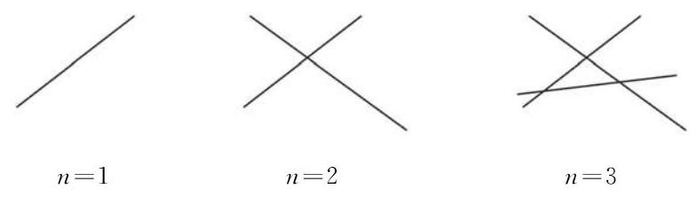

# 例题卡：例 4 在平面上画 $n$ 条直线,假设其中任意 2 条直线都相交,且任意 3 条直线都不共点. 设这 $n$ 条直线将平面分成了 ${a}_{n}$ 个部分.

例 4 在平面上画 $n$ 条直线,假设其中任意 2 条直线都相交,且任意 3 条直线都不共点. 设这 $n$ 条直线将平面分成了 ${a}_{n}$ 个部分.

(1)写出数列 $\left\{  {a}_{n}\right\}$ 的一个递推公式；

(2)写出数列 $\left\{  {a}_{n}\right\}$ 的一个通项公式.

解 (1) 我们先通过观察 $n = 1$ 、 2、3 时的图形来探究 ${a}_{n}$ 的情况.

从图 4-3-3 中可以看出:

当 $n = 1$ 时,第 1 条直线将平面分为两个部分,所以

$$
{a}_{1} = 2\text{ . }
$$

当 $n = 2$ 时,第 2 条直线与前面的 1 条直线相交,有 1 个交点. 这个交点将第 2 条直线分成 2 段, 且每一段将原有的平面部分进一步多分出两个部分, 所以

$$
{a}_{2} = {a}_{1} + 2\text{ . }
$$

当 $n = 3$ 时,第 3 条直线与前面的 2 条直线都相交,有 2 个交点. 这 2 个交点将第 3 条直线分成 3 段, 且每一段将原有的平面部分进一步多分出三个部分, 所以

$$
{a}_{3} = {a}_{2} + 3\text{ . }
$$

依此类推: 第 $n\left( {n \geq  2}\right)$ 条直线与前面的 $\left( {n - 1}\right)$ 条直线都相交, 有 $\left( {n - 1}\right)$ 个交点. 这 $\left( {n - 1}\right)$ 个交点将第 $n$ 条直线分成 $n$ 段,且每一段将原有的平面部分进一步多分出 $n$ 个部分,所以

$$
{a}_{n} = {a}_{n - 1} + n\left( {n \geq  2}\right) .
$$

这样,数列 $\left\{  {a}_{n}\right\}$ 可以用下面的递推公式表示:

$$
\left\{  \begin{array}{l} {a}_{n} = {a}_{n - 1} + n\left( {n \geq  2}\right) , \\  {a}_{1} = 2. \end{array}\right.
$$

(2)由上述递推公式, 有

$$
{a}_{2} = {a}_{1} + 2,
$$

$$
{a}_{3} = {a}_{2} + 3,
$$

$$
{a}_{4} = {a}_{3} + 4,
$$

...

$$
{a}_{n} = {a}_{n - 1} + n\left( {n \geq  2}\right) .
$$

由上述等式以及 ${a}_{1} = 2$ ,可得

$$
{a}_{n} = {a}_{1} + 2 + 3 + 4 + \cdots  + n
$$

$$
= {a}_{1} + \frac{\left( {n + 2}\right) \left( {n - 1}\right) }{2}
$$

$$
= \frac{{n}^{2} + n + 2}{2}\;\left( {n \geq  2}\right) .
$$

当 $n = 1$ 时,由于 ${a}_{1} = 2$ ,上面的等式也成立.

所以,数列 $\left\{  {a}_{n}\right\}$ 的通项公式为 ${a}_{n} = \frac{{n}^{2} + n + 2}{2}$ .
