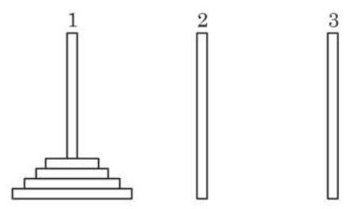
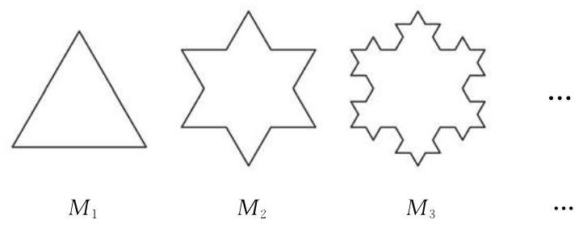

# 概念卡：拓展与思考

1. 如图所示, 有三根直杆和套在一根直杆上的若干金属片, 把金属片按下列规则从一根直杆上全部移到另一根直杆上:

① 每次只移动 1 个金属片;

② 较大的金属片不能放在较小的金属片上面.

试推测: 把 $n$ 个金属片从 1 号直杆移到 3 号直杆,最少需要移动多少次?

(第 1 题)

2. 如图, 将一个边长为 1 的正三角形的每条边三等分, 以中间一段为边向外作正三角形, 并擦去中间这一段, 如此继续下去得到的曲线称为科克雪花曲线. 将下面的图形依次记作 ${M}_{1}\text{ 、 }{M}_{2}\text{ 、 }{M}_{3}\text{ 、 }\cdots \text{ 、 }{M}_{n}\text{ 、 }\cdots$ .

(第 2 题)

(1)求 ${M}_{n}$ 的周长;

(2)求 ${M}_{n}$ 的面积；

(3)当 $n \rightarrow   + \infty$ 时,科克雪花曲线所围成的图形是周长无限增大而面积却有极限的图形吗? 若是, 请求出其面积的极限; 若不是, 请说明理由.
