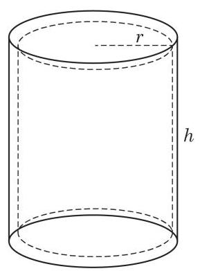

# 概念卡：建立模型

我们通过提出必要的假设, 引入适当的常量和变量, 得到相应的数学模型.

假设 1: 易拉罐容积相同,设为常数 $V$ ;

假设 2: 易拉罐是一个上下封闭的空心圆柱体, 其底部内半径设为 $r$ ,净高度设为 $h$ ,如图 2-1 所示;

假设 3:易拉罐的罐顶、罐体和罐底的厚度和材质都相同，其厚度设为 $d$ ,密度为 $\rho$ ,当材质确定后, $d\text{ 、 }\rho$ 均可以认为是常数.

根据假设 1 及 2,我们可以得到 $\pi {r}^{2}h = V$ . 根据假设 2 及 3,罐顶和罐底均可以看成一个圆柱体,质量均为 ${\rho \pi }{r}^{2}d$ . 罐体展开后可近似看作棱长分别为 ${2\pi r}\text{ 、 }h\text{ 、 }d$ 的长方体,其质量为 ${2\rho \pi rhd}$ . 这样,易拉罐总质量为 ${\rho d}\left( {{2\pi rh} + {2\pi }{r}^{2}}\right)$ ,其中 $d\text{ 、 }\rho$ 是常数,因此当 ${2\pi rh} + {2\pi }{r}^{2}$ 取最小值时,易拉罐的质量最小. 于是,我们得到以下数学模型:

已知常数 $V$ ,求变量 $r\text{ 、 }h$ 的值,使得在满足

$$
\pi {r}^{2}h = V
$$

①

的条件下,

$$
S = {2\pi }{r}^{2} + {2\pi rh}
$$

②

达到最小值.
