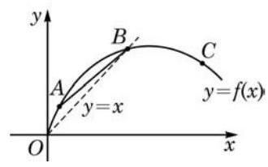

# 概念卡：A 组

1. 请根据图中的函数图像，将下列数值按从小到大的顺序排列:___.

(第 1 题)

① 曲线在点 $A$ 处切线的斜率；

② 曲线在点 $B$ 处切线的斜率；

③ 曲线在点 $C$ 处切线的斜率;

④ 割线 ${AB}$ 的斜率;

⑤ 数值 0 ;

⑥ 数值 1 .

2. 已知 $f\left( x\right)  = \sqrt{x}, g\left( x\right)  = k{x}^{2}$ .

(1)求曲线 $y = f\left( x\right)$ 在点 $\left( {4,2}\right)$ 处的切线方程；

(2)若曲线 $y = g\left( x\right)$ 经过点 $\left( {4,2}\right)$ ，求它与(1)中切线的另一个交点.

3. 从桥上将一小球掷向空中，小球相对于地面的高度 $h$ (单位: $\mathrm{m}$ )和时间 $t$ (单位: $\mathrm{s}$ ) 近似满足函数关系 $h =  - 5{t}^{2} + {15t} + {12}$ . 问:

(1)小球的初始高度是多少？

(2)小球在 $t = 0$ 到 $t = 1$ 这段时间内的平均速度是多少？

(3)小球在 $t = 1$ 时的瞬时速度是多少？

(4)小球所能达到的最大高度是多少？何时达到？

4. 已知 $f\left( x\right)  = {\mathrm{e}}^{x}, g\left( x\right)  = \ln x$ ,计算下列函数 $y = h\left( x\right)$ 在点 $x = 1$ 处的导数值:

(1) $h\left( x\right)  = {3f}\left( x\right)  - {5g}\left( x\right)$ ; (2) $h\left( x\right)  = f\left( x\right) g\left( x\right)$ ；

(3) $h\left( x\right)  = \frac{f\left( x\right) }{g\left( x\right) }$ ； (4) $h\left( x\right)  = f\left( {{2x} + 1}\right)  + g\left( {{3x} - 1}\right)$ .

5. 计算下列函数 $y = f\left( x\right)$ 的导数,其中:

(1) $f\left( x\right)  = \frac{\pi }{2} + \sin \left( {-x}\right)$ ； (2) $f\left( x\right)  = \sqrt[3]{x} - \frac{1}{{x}^{3}}$ ；___

(3) $f\left( x\right)  = \left( {\frac{1}{2}x - 5}\right) \left( {3 - {4x}}\right)$ ； (4) $f\left( x\right)  = \frac{\cos x}{{x}^{2}}$ .

6. 求下列函数 $y = f\left( x\right)$ 的单调区间和极值点,其中:

(1) $f\left( x\right)  = \frac{2}{3}x - 1$ (2) $f\left( x\right)  = 2 + x - {x}^{2}$ ；

(3) $f\left( x\right)  = {x}^{3} + {x}^{2} - {8x} + 7$ .

7. 借助第 6 题的结果,求下列函数 $y = f\left( x\right)$ 在给定区间上的最大值和最小值,其中:

(1) $f\left( x\right)  = \frac{2}{3}x - 1, x \in  \left\lbrack  {0,3}\right\rbrack$ ；

(2) $f\left( x\right)  = 2 + x - {x}^{2}, x \in  \left\lbrack  {-1,1}\right\rbrack$ ；

(3) $f\left( x\right)  = {x}^{3} + {x}^{2} - {8x} + 7, x \in  \left\lbrack  {-3,3}\right\rbrack$ .
