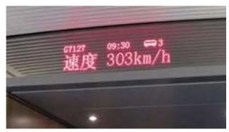

# 公式卡：1 导数的概念

当物体作匀速运动时,运动的速度 $v$ 等于距离 $s$ 除以运动时间 $t$ ,即 $v = \frac{s}{t}$ . 但是,如果一个作变速运动的物体在时间段 $t$ 内的运动距离是 $s$ ,上面的公式所给出的只能是这段运动过程中运动物体的平均速度 $\bar{v} = \frac{s}{t}$ .

当我们乘坐高铁时, 常常会在车厢内看到如图 5-1-1 所示的列车信息显示屏. 如何理解图中“速度 ${303}\mathrm{\;{km}}/\mathrm{h}$ ”呢?

仅用一个时间段内的平均速度难以准确地描述在该时间段内变速运动的过程. 为了精准地描述变速运动, 一个自然的想法是把整个运动时间分割成若干个小的时间段, 并分别求每个时间段内的平均速度. 可以想象, 随着时间段的分割越来越精细, 利用分段的平均速度就可以越来越精确地对整个运动过程进行描述.

以自由落体运动为例，已知物体下落的距离 $d$ (单位: $\mathrm{m}$ ) 与时间 $t$ (单位: $\mathrm{s}$ )满足函数关系 $d = \frac{1}{2}g{t}^{2}$ ,其中 $g$ 是重力加速度. 若近似地取 $g = {10}\mathrm{\;m}/{\mathrm{s}}^{2}$ ,则 $d = 5{t}^{2}$ .

考虑从 $t = 1$ 到 $t = 3$ (用区间符号记作 $\left\lbrack  {1,3}\right\rbrack$ )时间段内的自由落体运动. 它的平均速度是 $\frac{d\left( 3\right)  - d\left( 1\right) }{3 - 1} = {20}\left( {\mathrm{\;m}/\mathrm{s}}\right)$ . 如果把这段时间分成 $\left\lbrack  {1,2}\right\rbrack$ 与 $\left\lbrack  {2,3}\right\rbrack$ 两段，那么在这两个时间段内自由落体的平均速度分别是 $\frac{d\left( 2\right)  - d\left( 1\right) }{2 - 1} = {15}\left( {\mathrm{\;m}/\mathrm{s}}\right)$ 与 $\frac{d\left( 3\right)  - d\left( 2\right) }{3 - 2} = {25}\left( {\mathrm{\;m}/\mathrm{s}}\right)$ . 而如果以 ${0.5}\mathrm{\;s}$ 为间隔把 $\left\lbrack  {1,3}\right\rbrack$ 分为 4 个时间段,可以得出这 4 个时间段内的平均速度分别是 ${12.5}\mathrm{\;m}/\mathrm{s}\text{ 、 }{17.5}\mathrm{\;m}/\mathrm{s}\text{ 、 }{22.5}\mathrm{\;m}/\mathrm{s}$ 与 27.5 m/s. 由此可见，随着时间段的不断细分，自由落体的运动状态确实得到了越来越精确的描述. 这种做法其实蕴含着 “极限” 这个朴素而深刻的思想.

先把时间段分割，在越来越小的时间段内对运动进行分析， 再从整体上得到对运动状态越来越精确的描述, 这就是被称为 “微积分”的数学工具给我们提供的解决此类问题的基本途径. 在这里, 我们只介绍如何寻找适当的数学工具刻画运动物体在某一时刻的瞬时速度. 这里的瞬时速度指的是, 运动物体在临近指定时刻的某个时间段内的平均速度在时间段长度越来越小的变化过程中所趋近于的一个稳定值. 下面的例子展现了利用平均速度趋近瞬时速度的过程.
