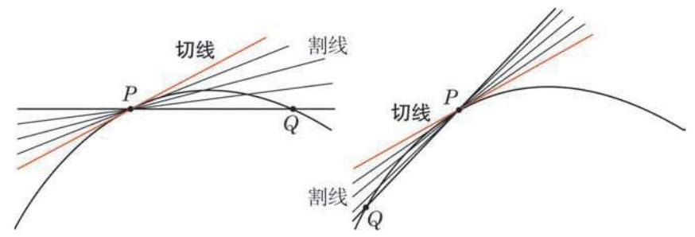
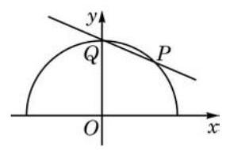

# 概念卡：2 导数的几何意义

在上一节中谈到, 在研究物体的变速运动时, 我们可以通过把时间分成若干个小的时间段, 并计算每个时间段内物体的平均速度, 以近似地描述物体的运动状况. 当时间段的划分越来越细时, 对运动的描述就越来越精确. 特别地, 在一个时间点附近的时间段越来越小时, 如果相应的平均速度趋近于一个稳定值, 这个稳定值就是运动物体在这个时间点的瞬时速度.

在几何学中有类似的情境:为了研究一条曲线的特性，我们可以把曲线划分成小段, 并把连接每一小段两端点的线段看作曲线的这一小段的近似. 当曲线的划分越来越细时, 由这些小线段所连接起来的折线就越来越接近于原来的曲线.

我们把连接曲线上任意两点的直线称为该曲线的一条割线 (secant line). 如图 5-1-2,给定曲线上的一点 $P$ ,考虑以 $P$ 为端点的一条小曲线段 $\overset{\text{ ⏜ }}{PQ}$ 和割线 ${PQ}$ . 像平均速度趋近于瞬时速度那样,当曲线段 $\overset{\text{ ⏜ }}{PQ}$ 取得越来越短,即点 $Q$ 越来越靠近点 $P$ 时,如果割线 ${PQ}$ 趋近于一条确定的直线,那么我们就将这条直线称为曲线在点 $P$ 处的切线 (tangent line). 就像瞬时速度是物体在给定时刻的运动状态的最好描述一样,在点 $P$ 处的切线是曲线在点 $P$ 附近性质的最好描述.

切线这个术语我们并不陌生, 在平面几何的学习中已定义过圆的切线, 并讨论过它的性质. 那里所定义的圆的切线是否与上面这个新定义一致呢?

