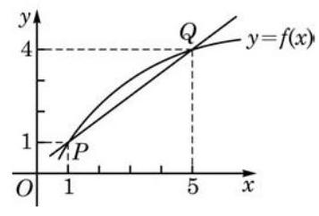
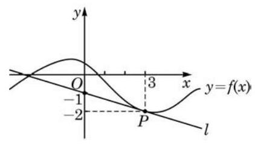

# 概念卡：习题 5.1

##### A 组

1. 自由落体运动的位移 $d$ (单位: $\mathrm{m}$ ) 与时间 $t$ (单位: $\mathrm{s}$ ) 满足函数关系 $d = \frac{1}{2}g{t}^{2}$ ( $g$ 为重力加速度).

(1)分别求[4,4.1]、[4,4.01]、[4,4.001]这些时间段内自由落体的平均速度；

(2)求 $t = 4$ 时的瞬时速度；

(3)求 $t = a\left( {a > 0}\right)$ 时的瞬时速度；

(4)借助(3)的结果，求 $t = \frac{5}{2}$ 时的瞬时速度.

2. 竖直向上发射的火箭熄火时上升速度达到 ${100}\mathrm{\;m}/\mathrm{s}$ ，此后其位移 $H$ (单位: $\mathrm{m}$ )与时间 $t$ (单位: $\mathrm{s}$ )近似满足函数关系 $H = {100t} - 5{t}^{2}$ .

(1)分别求火箭在 $\left\lbrack  {0,2}\right\rbrack$ 、 $\left\lbrack  {2,4}\right\rbrack$ 这些时间段内的平均速度；

(2)求火箭在 $t = 2$ 时的瞬时速度；

(3)熄火后多长时间火箭上升速度为 0

3. 某水管的流水量 $y$ (单位: ${\mathrm{m}}^{3}$ ) 与时间 $t$ (单位: $\mathrm{s}$ ) 满足函数关系 $y = f\left( t\right)$ ,其中 $f\left( t\right)  = {3t}.$

(1)求 $f\left( t\right)$ 在 $t = a$ 处的导数 ${f}^{\prime }\left( a\right)$ ；

(2) ${f}^{\prime }\left( a\right)$ 的实际意义是什么？

(3)随着 $a$ 的取值变化， ${f}^{\prime }\left( a\right)$ 是否发生变化？为什么？

4. 将石子投入水中，水面产生的圆形波纹不断扩散. 计算:

(1)当半径 $r$ 从 $a$ 增加到 $a + h\left( {h > 0}\right)$ 时,圆面积相对于半径的平均变化率;

(2)当半径 $r = a$ 时,圆面积相对于半径的瞬时变化率.

5. 函数 $y = f\left( x\right)$ 的图像如图所示.

(第 5 题)

(1)求割线 ${PQ}$ 的斜率；

(2)当点 $Q$ 沿曲线向点 $P$ 运动时,割线 ${PQ}$ 的斜率会变大还是变小?

6. 已知 $f\left( x\right)  =  - {x}^{2}$ ,求曲线 $y = f\left( x\right)$ 在下列各点处的切线斜率, 并说明这些斜率的值是如何随着自变量的变化而变化的:

(1) $x =  - 2$ ； (2) $x =  - 1$ ； (3) $x = 0$ ；

(4) $x = 1$ ； (5) $x = 2$ .

7. 借助函数图像,判断下列导数的正负:

(1) ${f}^{\prime }\left( {-\frac{\pi }{4}}\right)$ ，其中 $f\left( x\right)  = \cos x$ ； (2) ${f}^{\prime }\left( 3\right)$ ，其中 $f\left( x\right)  = \ln x$ .

##### B 组

1. 已知车辆启动后的一段时间内，车轮旋转的角度和时间 (单位:秒) 的平方成正比， 且车辆启动后车轮转动第一圈需要 1 秒.

(1)求车轮转动前 2 秒的平均角速度；

(2)求车轮在转动开始后第 3 秒的瞬时角速度.

2. 根据导数的几何意义,求函数 $y = \sqrt{4 - {x}^{2}}$ 在下列各点处的导数:

(1) $x =  - 1$ ； (2) $x = 0$ ； (3) $x = 1$ .

3. 已知函数 $y = f\left( x\right)$ 在 $x = 1$ 处的切线方程为 $y = {4x} - 3$ ,求 $f\left( 1\right)$ 和 ${f}^{\prime }\left( 1\right)$ .

4. 如图,已知直线 $l$ 是曲线 $y = f\left( x\right)$ 在 $x = 3$ 处的切线,求 ${f}^{\prime }\left( 3\right)$ .

(第 4 题)
