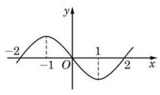

# 概念卡：B 组

(第 1 题)

1. 已知 $y = {f}^{\prime }\left( x\right)$ 的图像如图所示,求函数 $y = f\left( x\right)$ 在 $\left( {-2,2}\right)$ 上的单调区间和极值点.

2. 若直线 $y = x$ 是曲线 $y = {x}^{3} - 3{x}^{2} + {ax}$ 的切线,求 $a$ 的值.

3. 设函数 $y = {x}^{3} + a{x}^{2} + {bx} + c$ 的图像与 $y = 0$ 在原点相切, 若函数的极小值为 -4 ，求函数的表达式与单调减区间.

4. 某种型号的汽车在匀速行驶中每小时的耗油量 $y$ (单位: $\mathrm{L}$ ) 关于行驶速度 $x$ (单位: $\mathrm{{km}}/\mathrm{h}$ ) 满足函数关系 $y = \frac{1}{128000}{x}^{3} - \frac{3}{80}x + 8\left( {0 < x \leq  {120}}\right)$ . 已知甲、乙两地相距 100 km. 问:当汽车保持怎样的速度匀速行驶时，从甲地到乙地的耗油量最小?

5. 要建造一个给定容积 $V$ 的圆柱体蓄水池,已知池底单位造价为池侧面单位造价的 2 倍. 问: 应如何选择蓄水池的底面半径 $r$ 和高 $h$ ,才能使总造价最低?

6. 已知某厂生产一种产品的总成本 $C$ (单位:万元) 与产品件数 $x$ 满足函数关系 $C = {1200} + \frac{2}{75}{x}^{3}$ ,产品单价 $P$ (单位: 万元)和产品件数 $x$ 满足函数关系 ${P}^{2} = \frac{250000}{x}$ . 问: 产量为多少件时, 总利润最大?
