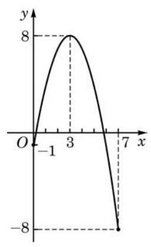

# 概念卡：3 利用导数研究函数的最值

在许多理论和现实的问题中, 常常需要求函数的最大值或者最小值(统称为最值). 最值反映了函数在定义域上整体的情况， 而极值则仅考虑函数在某点附近的局部特征. 有时最值和极值是一致的,如函数 $y = \sin x$ ; 但有时却不一致,如图 5-3-2 所示的函数. 当然, 一个函数的极值与最值可能都不存在, 如函数 $y = {x}^{3}$ . 但是,如果考虑一个在闭区间上的连续函数,函数的最大值与最小值一定存在.

上面所说的一个区间 $I$ 上的连续函数,可以直观地理解为在区间 $I$ 上图像为一条连绵不断的曲线的函数. 更精确及普适的连续函数的定义, 要用到严格的极限语言, 在高等数学中才能给出.
