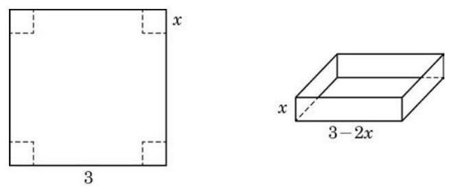

# 例题卡：例 11 图 5-3-4 是一张边长为 3 的正方形硬纸板, 现把它的四个角上裁去边长为 $x$ 的四个小正方形,再折叠成无盖纸盒. 当裁去的小正方形边长 $x$ 发生变化时,纸盒的容积 $V$ 会随之发生变化. 当 $x$ 在什么范围内变化时,容积 $V$ 随着 $x$ 的增大而增大? $x$ 在什么范围内变化时,容积 $V$ 随着 $x$ 的增大而减小? 当 $x$ 取何值时,容积 $V$ 最大? 最大值是多少? (纸板厚度忽略不计)

例 11 图 5-3-4 是一张边长为 3 的正方形硬纸板, 现把它的四个角上裁去边长为 $x$ 的四个小正方形,再折叠成无盖纸盒. 当裁去的小正方形边长 $x$ 发生变化时,纸盒的容积 $V$ 会随之发生变化. 当 $x$ 在什么范围内变化时,容积 $V$ 随着 $x$ 的增大而增大? $x$ 在什么范围内变化时,容积 $V$ 随着 $x$ 的增大而减小? 当 $x$ 取何值时,容积 $V$ 最大? 最大值是多少? (纸板厚度忽略不计)

解 由题意, 得

$$
V\left( x\right)  = x{\left( 3 - 2x\right) }^{2}, x \in  \left( {0,\frac{3}{2}}\right) .
$$

求导可得

$$
{V}^{\prime }\left( x\right)  = {12}{x}^{2} - {24x} + 9.
$$

为求驻点,令 ${12}{x}^{2} - {24x} + 9 = 0$ ,得 ${x}_{1} = \frac{1}{2}$ 与 ${x}_{2} = \frac{3}{2}$ ,后者不在定义域内，舍去.

容易算出，当 $x \in  \left( {0,\frac{1}{2}}\right)$ 时， ${V}^{\prime }\left( x\right)  > 0$ ；当 $x \in  \left( {\frac{1}{2},\frac{3}{2}}\right)$ 时， ${V}^{\prime }\left( x\right)  < 0$ . 因此,当 $x$ 在 0 到 $\frac{1}{2}$ 之间变化时,容积 $V$ 随着 $x$ 的增大而增大; 当 $x$ 在 $\frac{1}{2}$ 到 $\frac{3}{2}$ 之间变化时,容积 $V$ 随着 $x$ 的增大而减小; 而当 $x = \frac{1}{2}$ 时,容积 $V\left( \frac{1}{2}\right)  = 2$ 是极大值,也是最大值.
