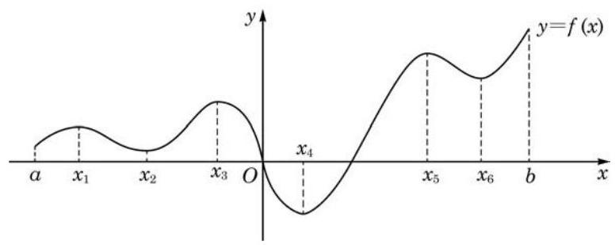

# 定理卡：2 利用导数研究函数的极值

观察图 5-3-2 中函数 $y = f\left( x\right)$ 的图像,其中有一些特殊的点, 在这些特殊点的左右两侧附近, 函数的单调性发生了改变. 例如,函数在点 $\left( {{x}_{1}, f\left( {x}_{1}\right) }\right)$ 的左侧附近严格增,右侧附近严格减，此处出现了一个“山峰”；又如，函数在点 $\left( {{x}_{2}, f\left( {x}_{2}\right) }\right)$ 的左侧附近严格减，右侧附近严格增，此处出现了一个“山谷”.

换句话说,在 $x = {x}_{1}$ 附近存在一个小区间,该区间内其他自变量所对应的函数值都不大于 $f\left( {x}_{1}\right)$ ,此时,就说函数 $y = f\left( x\right)$ 在 $x = {x}_{1}$ 处取得极大值 $f\left( {x}_{1}\right)$ ,而点 ${x}_{1}$ 称为函数 $y = f\left( x\right)$ 的极大值点. 类似地,在 $x = {x}_{2}$ 附近存在一个小区间,该区间内其他自变量所对应的函数值都不小于 $f\left( {x}_{2}\right)$ ,此时,就说函数 $y = f\left( x\right)$ 在 $x = {x}_{2}$ 处取得极小值 $f\left( {x}_{2}\right)$ ,而点 ${x}_{2}$ 称为函数 $y = f\left( x\right)$ 的极小值点.

因此,图 5-3-2 所示的函数有三个极大值点 ${x}_{1}\text{ 、 }{x}_{3}\text{ 、 }{x}_{5}$ , 还有三个极小值点 ${x}_{2}\text{ 、 }{x}_{4}\text{ 、 }{x}_{6}$ .

极大值和极小值统称为极值, 而极大值点和极小值点则统称为极值点.

在导数都存在的前提下, 极值点一定是相应函数单调增区间及单调减区间的分界点, 从而是函数的驻点, 函数曲线在该点的切线是水平的. 但反过来, 我们却不能说一个函数的驻点一定是其极值点. 例如,在函数 $y = {x}^{3}$ 中,点 $x = 0$ 虽是其驻点,但不是极值点,因为这个函数在整个区间 $\left( {-\infty , + \infty }\right)$ 上是严格增的. 因此,要找到函数 $y = f\left( x\right)$ 的极值点,通过 ${f}^{\prime }\left( {x}_{0}\right)  = 0$ 找到驻点 $x = {x}_{0}$ 只是第一步,还要根据驻点附近 ${f}^{\prime }\left( x\right)$ 的符号才能断定 ${x}_{0}$ 是否为 $f\left( x\right)$ 的极值点.

具体地说,我们有如下定理:
