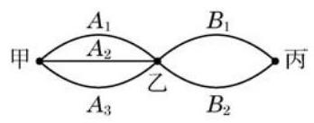

# 方法卡：1 乘法原理

先看下面的问题:

如图 6-1-1,从甲地到丙地,需经过乙地. 其中,从甲地到乙地有 3 条路线 ${A}_{1}\text{ 、 }{A}_{2}\text{ 、 }{A}_{3}$ ,而从乙地到丙地有 2 条路线 ${B}_{1}$ 、 ${B}_{2}$ . 那么,从甲地经由乙地到丙地,共有多少种不同的走法?

从甲地到乙地有 3 种不同的走法, 按其中任何一种走法到达乙地后, 再由乙地到丙地又有 2 种不同的走法. 于是, 不同的走法就有以下 6 种情形 (其中符号 ${A}_{1}{B}_{1}$ 的含义是 "先走路线 ${A}_{1}$ , 再走路线 ${B}_{1}$ ",其余类同):

$$
{A}_{1}{B}_{1}\text{ 、 }{A}_{1}{B}_{2}\text{ 、 }{A}_{2}{B}_{1}\text{ 、 }{A}_{2}{B}_{2}\text{ 、 }{A}_{3}{B}_{1}\text{ 、 }{A}_{3}{B}_{2}.
$$

其中，每一种情形都可"从甲地经由乙地到丙地". 因此，从甲地经由乙地到丙地共有

$$
3 \times  2 = 6
$$

种不同的走法.

这里使用的就是下面的

乘法原理(分步计数原理) 做一件事,需要依次完成 $n$ 个步骤,其中完成第一步有 ${a}_{1}$ 种不同的方法,完成第二步有 ${a}_{2}$ 种不同的方法, $\cdots \cdots$ ,完成第 $n$ 步有 ${a}_{n}$ 种不同的方法. 那么完成这件事共有

$$
{a}_{1}{a}_{2}\cdots {a}_{n}
$$

种不同的方法.
