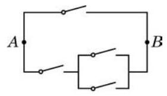

# 方法卡：B 组

1. 乘积 $\left( {{a}_{1} + {a}_{2}}\right) \left( {{b}_{1} + {b}_{2} + {b}_{3}}\right) \left( {{c}_{1} + {c}_{2} + {c}_{3} + {c}_{4}}\right)$ 的展开式中有多少项?

2. 如图,要接通从 $A$ 到 $B$ 的电路,不同的接通方法有多少种?

(第 2 题)

3. 用 1、2、3、4、5、6 组成没有重复数字的六位数，要求所有相邻两个数字的奇偶性都不同, 且 1 和 2 相邻. 问: 有多少个这样的六位数?

4. 已知 ${p}_{1}\text{ 、 }{p}_{2}\text{ 、 }{p}_{3}$ 是互不相同的素数, $\alpha \text{ 、 }\beta \text{ 、 }\gamma$ 是正整数, $n = {p}_{1}^{\alpha }{p}_{2}^{\beta }{p}_{3}^{\gamma }$ . 问: $n$ 有多少个不同的正约数?
